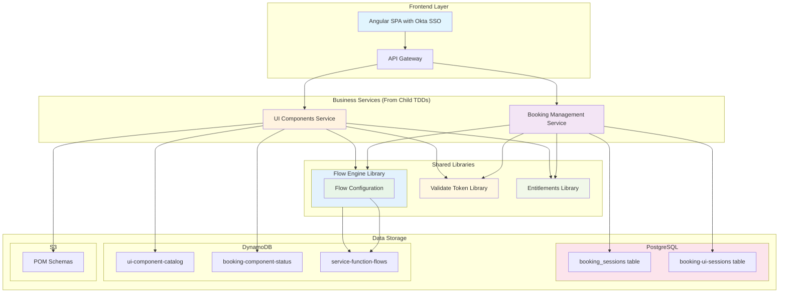
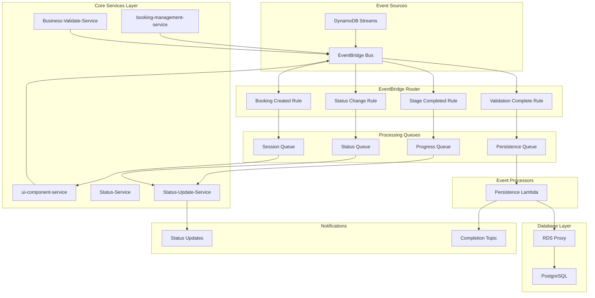
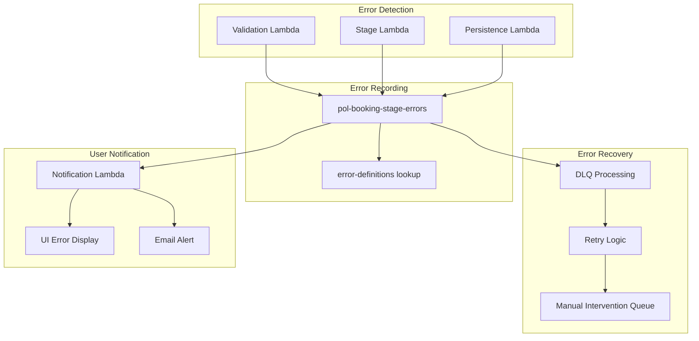
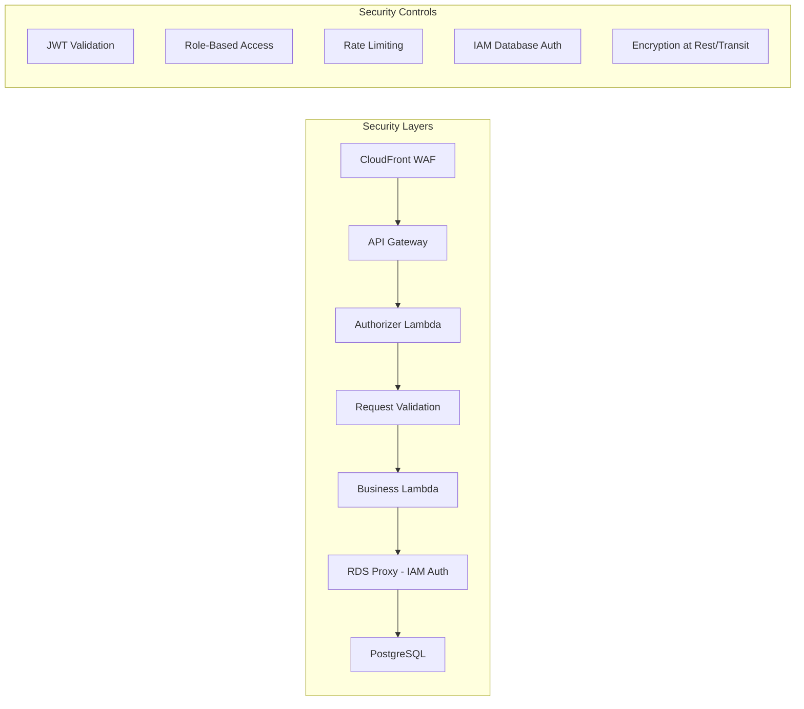
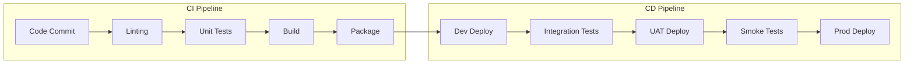

# Master Technical Design Document - Inscore Policy Booking Application (Updated)

## 1. Introduction

This Master Technical Design Document (TDD) outlines the architectural blueprint and core technical specifications for the **Inscore Policy Booking Application**. It serves as the primary reference for all technical development, ensuring consistency and alignment across various components. This document would be a living artefact during the course of Inscore **Policy Booking** development, laying the groundwork for a scalable and robust system. Subsequent Feature TDDss will delve into the granular details of the UI and individual Lambda functions.

## 2. Architecture Overview

The Inscore application adopts a **serverless-first architecture** leveraging AWS services to provide a highly scalable, resilient, and cost-effective solution. The core components include an Angular frontend, an API Gateway, AWS Lambda functions for business logic, DynamoDB for session and stage management, and PostgreSQL with RDS Proxy for persistent policy data.

### 2.1. Key Components:

- **User Interface (UI)**: Developed using **Angular**, providing a dynamic and responsive experience for policy booking.

- **API Gateway**: Acts as the **single entry point** for all UI requests, routing them to the appropriate backend Lambda functions. It handles request/response transformations, authentication, and throttling.

- **AWS Lambda (Business APIs)**: A set of **stateless functions** triggered by API Gateway. These lambdas encapsulate the core business logic for processing policy-related requests from the UI.

- **AWS Lambda (Event-Driven Backend)**: Additional **event-driven lambdas** will handle asynchronous tasks, data processing, and data retrieval from various sources. These are triggered by events (e.g., SQS, SNS, DynamoDB Streams).

- **AWS DynamoDB**: A **NoSQL database** used for high-performance key-value storage. It will primarily manage **user sessions** and track the **stages of the policy booking process**.

- **PostgreSQL (AWS RDS)**: A **relational database** for **final persistence of policy data**. This ensures data integrity and supports complex querying for reporting and analytical purposes.

- **AWS RDS Proxy**: A **database proxy** that sits between Lambda functions and RDS PostgreSQL, providing connection pooling, improved scalability, and enhanced security for database connections.

## 3. Service Library

### 3.1 Service Architecture Overview

The Inscore application implements a service-oriented architecture with clear separation of concerns. Services are categorized into Core Services, Integration Services, and External Services, each with specific responsibilities in the policy booking flow.

### 3.2 Core Services and Shared Libraries


This Service Library will keep getting modified as we proceed with New Services development
| Service Name | Runtime | Memory | Invocation | Integration | Description | Data Flow Responsibility |
|-------------|---------|---------|------------|-------------|-------------|-------------------------|
| **Booking-Management-Service** | Node.js 20.x.x Lambda | 512MB | Sync | API Gateway, Shared Libraries | Handles booking initiation using Flow Engine, Validate Token, and Entitlements libraries | Creates booking sessions in PostgreSQL booking_sessions table and updates booking-ui-sessions table in RDS |
| **UI-Components-Service** | Node.js 20.x.x Lambda | 768MB | Sync | API Gateway, Shared Libraries | Manages UI component delivery using shared libraries for flow execution | Queries DynamoDB ui-component-catalog and booking-component-status tables |

#### 3.2.2 Shared Libraries (Reusable Components)
| Library Name | Runtime | Deployment | Integration | Description | Usage Pattern |
|-------------|---------|-------------|------------|-------------|---------------|
| **Flow-Engine-Library** | Node.js 20.x.x | Lambda Layer / npm package | DynamoDB | Single reusable library for configurable function flow execution | Used by all business services for dynamic workflow execution |
| **Validate-Token-Library** | Node.js 20.x.x | Lambda Layer / npm package | External Auth Provider | Centralized JWT token validation service | Shared across all services requiring authentication |
| **Entitlements-Library** | Node.js 20.x.x | Lambda Layer / npm package | Permission Service | Unified user permission checking service | Used by all services for authorization decisions |

#### 3.2.3 Integration Services
| Service Name | Runtime | Memory | Invocation | Integration | Description | Data Flow Responsibility |
|-------------|---------|---------|------------|-------------|-------------|-------------------------|
| **Product-Reference-Data-Service** | Node.js 20.x.x Lambda / ECS Fastify* | 2GB | Sync, Async | API Gateway | **INSCORE DEVELOPMENT: Returns static product data from Lambda layer** | Provides product hierarchy for POM structure |
| **Reference-Data-Service** | Node.js 20.x.x Lambda / ECS Fastify* | 2GB | Sync | API Gateway | **INSCORE DEVELOPMENT: Returns static reference data from Lambda layer** | Supplies reference data for dropdowns/lookups |
| **Policy-Retrieval** | Node.js 20.x.x Lambda | 2GB | Batch, Async | API Gateway, Step Function, **RDS Proxy** | Fetches existing policies for ENDORSEMENT/MTA with pagination | Retrieves from PostgreSQL via RDS Proxy, converts to POM JSON |

*Note: Product-Reference-Data-Service and Reference-Data-Service will initially be deployed as Lambda functions for rapid development during Inscore development. Post-development, they can be migrated to ECS containers with Fastify framework if performance requirements demand it.

### 3.3 Service Orchestration with Initiate Booking and Client Information Design



### 3.4 Enhanced Service Orchestration Components

#### 3.4.1 Business Services Layer (Based on Child TDDs)
- **Booking Management Service**: Handles booking initiation requests with configurable function flows (from Initiate Booking design)
- **UI Components Service**: Manages dynamic UI component delivery based on booking workflow (from Client Information design)

#### 3.4.2 Shared Libraries Layer
- **Flow Engine Library**: Single reusable library for configurable function flow execution across services
- **Validate Token Library**: Centralized JWT token validation service used by business services
- **Entitlements Library**: Unified user permission checking service shared across the platform

#### 3.4.3 Service Integration Patterns (From Child TDDs)
- **Booking Management Service → Libraries**: Uses Flow Engine for configurable execution, Validate Token for JWT validation, Entitlements for permission checking
- **UI Components Service → Libraries**: Leverages all three libraries for component delivery, navigation, and security

#### 3.4.4 Flow Configuration Layer (From DynamoDB Design)
- **service-function-flows**: DynamoDB table storing configurable function chains used by Flow Engine Library
- **Dynamic Execution**: Both services use Flow Engine Library to access flow configurations for different endpoints from service-function-flows table

#### 3.4.5 Data Storage Patterns (From Child TDDs)
- **PostgreSQL**: Booking Management Service stores booking sessions in booking_sessions table and updates booking-ui-sessions table in RDS
- **DynamoDB**: Three tables serving different purposes:
  - `ui-component-catalog`: UI component configurations (used by UI Components Service)
  - `booking-component-status`: Component status tracking (used by UI Components Service)
  - `service-function-flows`: Flow configurations (used by Flow Engine Library)
- **S3**: UI Components Service retrieves Policy Object Model schemas from S3 for dynamic form generation

Note: pol-booking-json-store (DDB3) is designed but NOT implemented for Inscore development

### 3.6 Data Flow Validation

**Transient Save Flow (ui-component-service → DynamoDB):**
1. ui-component-service receives stage data from UI
2. Validates against POM schema
3. Stores in booking-component-status
4. Updates booking-component-status with completion status
5. Maintains session state in ui-sessions
✅ **Achievable**: Service design supports incremental stage saves

**Permanent Save Flow (Validation → PostgreSQL via RDS Proxy):**
1. Business-Validate-Service performs final validation
2. On success, publishes event to EventBridge
3. Persistence Lambda triggered via SQS
4. Connects to PostgreSQL through RDS Proxy for connection pooling
5. Transforms complete POM JSON to relational model
6. Writes to PostgreSQL tables via RDS Proxy connection
7. Archives complete JSON to S3
8. Status-Update-Service updates booking status to COMPLETED
✅ **Achievable**: Service architecture ensures validated data reaches PostgreSQL with optimized connection management

### 3.4 Service Dependencies Matrix

| Service | Upstream Dependencies | Downstream Dependencies | Critical for |
|---------|----------------------|------------------------|--------------|
| booking-management-service | None (Entry point) | ui-component-service | Transaction initiation |
| ui-component-service | booking-management-service | DynamoDB Streams (triggers validation) | Stage data management |
| Business-Validate-Service | DynamoDB Streams (async trigger) | Status-Update-Service, EventBridge | Async data validation |
| Status-Service | None (Read-only) | None (Query service) | Status visibility |
| Status-Update-Service | EventBridge, Business-Validate-Service | None (Terminal service) | Event-driven updates |
| Product-Reference-Data-Service | None (Master data) | ui-component-service (provides product data) | Product configuration |
| Policy-Retrieval | **RDS Proxy** (for PostgreSQL access) | ui-component-service (provides existing policy) | Non-NB transactions |
| Reference-Data-Service | None (Master data) | ui-component-service (provides reference data) | Master data |

**Dependency Flow Clarification:**
- **booking-management-service** → **ui-component-service**: booking-management-service creates booking ID, then calls ui-component-service to initialize session (**INSCORE DEVELOPMENT: No Secrets Manager call**)
- **ui-component-service** → **DynamoDB**: Saves stage data immediately without validation blocking
- **DynamoDB Streams** → **Business-Validate-Service**: Async validation triggered by data changes
- **Business-Validate-Service** → **pol-booking-stage-errors**: Records validation failures for UI polling (**INSCORE DEVELOPMENT: Using embedded validation logic**)
- **Final Submit Validation**: Aggregates all stage validation statuses before allowing PostgreSQL persistence via RDS Proxy

## 4. Data Model

The application will utilize a **hybrid data storage approach** to optimize for different data access patterns and consistency requirements.

### 4.1. AWS DynamoDB (Session & Stage Management)

DynamoDB will store **transient and rapidly changing data** related to the user's current session and booking progress.

- **Purpose**: Fast read/write access for session management and tracking the current stage of a policy application.

- **Key Entities**:
    - Session: Stores user session tokens, expiration times, and potentially basic user identifiers.
    - BookingStage: Tracks the current step of a policy application for a given user, including partially captured data.

### 4.2. PostgreSQL with RDS Proxy (Policy Persistence)

PostgreSQL will serve as the **source of truth for all finalized policy data**, leveraging its relational capabilities for complex data structures and ACID compliance. **RDS Proxy** provides connection pooling and management for Lambda functions.

- **Purpose**: Reliable, structured storage for complete policy information, supporting complex queries and reporting with optimized connection management.

- **RDS Proxy Configuration**:
    - **Connection Pooling**: Manages and reuses database connections
    - **IAM Authentication**: Secure authentication without embedding credentials
    - **Target Database**: RDS PostgreSQL instance
    - **Max Connections**: Configured based on Lambda concurrency

- **Key Entities (Initial Inscore Development Focus based on POM XSD/JSON)**:
    - Policy: Main policy details.
    - Client: Information about the policyholder.
    - Location: Details of insured locations.
    - Product: Product-specific attributes.
    - *Further entities from POM XSD/JSON will be integrated in subsequent phases.*

## 5. API Design (Frontend-Backend)

The Angular UI will communicate with the backend via **RESTful APIs** exposed through API Gateway.

### 5.1. API Endpoints (Updated with Initiate Booking and Client Information)

#### 5.1.1 Initiate Booking Endpoints (Booking Management Service)
- **POST /booking/initiate**: Start a new policy booking session, returning a bookingId
  - Headers: Authorization (Bearer JWT), X-Config-Key (optional)
  - Request: `{"transactionType": "NB"}`
  - Response: `{"success": true, "data": {"bookingId": "BK-2024-001234567", "transactionType": "NB", "userId": "user123", "status": "INITIATED", "createdAt": "ISO-8601"}, "timestamp": "ISO-8601"}`

#### 5.1.2 Client Information Endpoints (UI Components Service)
- **GET /ui/booking/{bookingId}/nextComponent**: Get next component based on current booking position
  - Query: `transactionType` (required)
  - Response: Component configuration with POM schema for dynamic form generation

- **PUT /ui/booking/{bookingId}/components/status**: Save component data and optionally navigate to next component
  - Request: Component data with optional `nextComponentId` for navigation
  - Response: Save confirmation with next component information

- **GET /ui/booking/{bookingId}/components**: Get component by componentId and transactionType
  - Query: `componentId`, `transactionType` (both required)
  - Response: Specific component configuration and POM schema

- **GET /ui/booking/{bookingId}/pom-schema**: Get POM schema for component
  - Query: `componentId`, `transactionType` (both required)
  - Response: Policy Object Model schema for dynamic form generation

#### 5.1.3 Integration Notes
- Both services use shared libraries (Flow Engine, Validate Token, Entitlements) for consistent behavior
- All endpoints support configurable function flows based on X-Config-Key header
- Authentication and authorization handled through shared library integration

### 5.2. Request/Response Structure

- All requests and responses will use **JSON format**.
- Standard HTTP status codes will indicate success or failure.
- Error responses will include a clear error code and message.

## 6. Backend Processing (Event-Driven)

Beyond the direct API lambdas, event-driven lambdas will handle asynchronous operations, promoting a decoupled and scalable backend.

### 6.1. Event Sources

- **DynamoDB Streams**: Changes to BookingStage items in DynamoDB can trigger lambdas to perform actions like:
    - **Data Validation**: Perform deeper, asynchronous validation of stage data.
    - **Progress Notifications**: Send notifications (e.g., email, in-app) about booking progress.

- **SQS/SNS**: For tasks that don't require immediate processing or need to be retried, messages can be sent to SQS queues or SNS topics, which then trigger lambdas.
    - **Policy Finalization**: A message to an SQS queue could trigger a lambda to move data from DynamoDB to PostgreSQL via RDS Proxy after a booking is marked complete.

## 7. Security Considerations

Security will be a paramount concern throughout the application lifecycle.

- **Authentication**: Users will authenticate to obtain a **session token**, which will be validated by API Gateway.
- **Authorization**: API Gateway will enforce **access control** based on the authenticated user's permissions.
- **Database Security**: **RDS Proxy** provides IAM-based authentication, eliminating the need to store database credentials.
- **Data Encryption**: Data at rest (DynamoDB, PostgreSQL) and in transit (API Gateway, Lambda, RDS Proxy) will be **encrypted**.
- **Input Validation**: All API inputs will be rigorously **validated** to prevent common vulnerabilities.

## 8. Deployment Strategy

For Inscore development, a streamlined deployment process will be used.

- **Infrastructure as Code (IaC)**: AWS CloudFormation or Serverless Framework will define and deploy all AWS resources (Lambdas, API Gateway, DynamoDB, RDS, RDS Proxy). DBs, RDS Proxy, and API gateway are part of IaC, lambda are part of application CI/CD
- **CI/CD (Basic)**: A simple CI/CD pipeline will automate building, testing, and deploying the application components.

## 9. Monitoring & Logging

Observability is crucial for a serverless application.

- **AWS CloudWatch**: All Lambda logs will be sent to CloudWatch Logs. Custom metrics and alarms will be configured for critical application performance indicators.
- **RDS Proxy Metrics**: Monitor connection pool usage, database connections, and query latency through CloudWatch.
- **Distributed Tracing**: AWS X-Ray will be used to trace requests across services, including database calls through RDS Proxy, aiding in debugging and performance optimization.

## 10. Future Enhancements (Beyond Initial Development)

Beyond the initial development, the Inscore application will evolve to include:

- **Comprehensive Policy Management**: Full CRUD operations for all policy elements defined in POM.
- **Advanced Workflow Engine**: Orchestration of complex, multi-step policy processing.
- **Integration with External Systems**: Third-party services for underwriting, payment processing, etc.
- **Reporting & Analytics**: Landing Page insights/Enquiry Dashboard.
- **Enhanced Security**: Okta Authentication.

## 11. Feature TDDs

This master TDD will be complemented by detailed Feature TDDss for each major component:

- **UI TDD**: Specifics of the Angular frontend design, components, state management, and interaction patterns.
- **Lambda TDDs**: Individual design documents for each Lambda function, detailing its purpose, input/output contracts, business logic, and error handling.

## 12. UI Architecture & POM Data Capture

### 12.1 Overview
The UI will implement a tab-based navigation system that mirrors the hierarchical structure of the POM (Policy Object Model) defined in pom-sub.xsd. Each level of the POM hierarchy corresponds to specific UI tabs and sections, with dynamic stage progression tracked in DynamoDB.

### 12.2 POM-to-UI Mapping

```
POM Hierarchy → UI Structure
├── L0: BookingPolicy → Main Policy Tab
│   ├── Policy Details Section
│   ├── Transaction Type Selector
│   └── Date Management Section
├── L1: Client → Client Information Tab
│   ├── Client Type Selection
│   ├── Individual/Organization Forms
│   └── Address Management
├── L1: Producer → Producer Tab
│   ├── Producer Selection
│   └── Commission Configuration
├── L2: Product → Product Configuration Tab
│   ├── Product Selection
│   └── Premium Calculation
├── L3: Location → Locations Tab
│   ├── Location List
│   └── Address Details
├── L4: Section → Sections Sub-Tab
│   └── Coverage Groups
├── L5: Risk → Risks Sub-Tab
│   └── Risk Objects
└── L6: Coverage → Coverage Sub-Tab
    └── Coverage Details
```

### 12.3 Stage Management Architecture (Based on Actual DynamoDB Design)

#### 12.3.1 DynamoDB Table Schemas

Please refer to "dynamodb-specification.md" for dynamodb schema & data details

#### 12.3.2 Stage Configuration for Transaction Types

**New Business Stages:**
```json
[
  { "stageId": 1, "stageName": "Client Info", "required": true },
  { "stageId": 2, "stageName": "Producer Info", "required": true },
  { "stageId": 3, "stageName": "Product & Policy Info", "required": true },
  { "stageId": 4, "stageName": "Location Details", "required": true },
  { "stageId": 5, "stageName": "Sections & Risks", "required": true },
  { "stageId": 6, "stageName": "Coverage Selection", "required": true },
  { "stageId": 7, "stageName": "Rating", "required": true },
  { "stageId": 8, "stageName": "Submit", "required": true }
]
```

**Endorsement Stages:**
```json
[
  { "stageId": 1, "stageName": "Policy Selection", "required": true },
  { "stageId": 2, "stageName": "Endorsement Type", "required": true },
  { "stageId": 3, "stageName": "Modification Details", "required": true },
  { "stageId": 4, "stageName": "Rating", "required": true },
  { "stageId": 5, "stageName": "Submit", "required": true }
]
```

#### 12.3.3 S3 Storage Structure
```
s3://inscore-policy-data/
├── bookings/
│   └── <pol-booking-id>/
│       ├── complete-pom.json
│       └── stages/
│           ├── stage-1-client-info.json
│           ├── stage-2-producer-info.json
│           ├── stage-3-product-policy.json
│           └── ...
├── submitted/
│   └── <policy-no>/
│       └── <pol-booking-id>/
│           └── final-policy.json
└── archives/
    └── <year>/<month>/<day>/
        └── <policy-no>-<pol-booking-id>.json
```

## 13. API Design & Data Flow Patterns

### 13.1 Core API Endpoints (Service-Based Architecture)

#### 13.1.1 booking-management-service APIs
```yaml
POST /booking/initiate:
  description: Create new booking ID and initialize transaction
  service: booking-management-service
  request:
    transaction-type: "NEW_BUSINESS|ENDORSEMENT|RENEWAL"
    user-code: string
    pol-office-cd: string
  response:
    pol-booking-id: string
    api-config: object # from Secrets Manager
    stages: array (transaction-specific stages)
```

#### 13.1.2 config-service APIs
```yaml
GET /config/api-settings:
  description: Retrieve API configuration 
  service: config-service
  parameters:
    service-name: string
  response:
    api-url: string
    auth-config: object
    timeout-settings: object
```

#### 13.1.3 ui-component-service APIs
```yaml
GET /ui/booking/{bookingId}/nextComponent:
  description: Automatically retrieve the next UI component based on current workflow position
  service: ui-component-service
  parameters:
    bookingId: string (path, required)
    transactionType: string (query, required)
  headers:
    Authorization: Bearer {JWT_TOKEN}
    X-Config-Key: string (optional, defaults to "default")
  response:
    success: boolean
    data:
      bookingId: string
      componentId: string (automatically determined from currentPosition = true)
      componentConfiguration: object (componentSpecifications from ui-component-catalog)
      pomSchema: object (from S3)
        modelName: string
        version: string
        fields: object
      workflowMetadata: object
        currentStep: number
        totalSteps: number
        previousComponent: string
        nextComponent: string
        canGoBack: boolean
        canProceed: boolean
    timestamp: string

POST /ui/booking/{bookingId}/workflow/initialize:
  description: Initialize booking workflow and retrieve current component configuration
  service: ui-component-service
  parameters:
    bookingId: string (path, required)
  headers:
    Authorization: Bearer {JWT_TOKEN}
    X-Config-Key: string (optional, defaults to "default")
  request:
    transactionType: string (required)
  response:
    success: boolean
    data:
      bookingId: string
      componentConfiguration: object
        componentId: string
        formFields: array
        actionUrls: object
        layout: object
      pomSchema: object
        modelName: string
        version: string
        fields: object
      workflowMetadata: object
        currentStep: number
        totalSteps: number
        percentageComplete: number
        componentStatus: string
        allowedActions: array
    timestamp: string

PUT /ui/booking/{bookingId}/components/status:
  description: Update component status and manage workflow progression
  service: ui-component-service
  parameters:
    bookingId: string (path, required)
    componentId: string (query, required)
    nextComponentId: string (query, optional - for sidebar navigation)
  headers:
    Authorization: Bearer {JWT_TOKEN}
    X-Config-Key: string (optional, defaults to "default")
  request:
    status: string (required - "IN_PROGRESS|COMPLETED|NOT_STARTED")
    transactionType: string (required)
    componentData: object (required - POM schema conformant data)
  response:
    success: boolean
    data:
      bookingId: string
      componentId: string
      status: string
      nextComponentId: string
      updatedAt: string (ISO 8601)
      workflowProgress: object
        currentStep: number
        totalSteps: number
        percentageComplete: number
    timestamp: string

GET /ui/booking/{bookingId}/components:
  description: Retrieve specific UI component configuration by componentId and transactionType
  service: ui-component-service
  parameters:
    bookingId: string (path, required)
    componentId: string (query, required)
    transactionType: string (query, required)
  headers:
    Authorization: Bearer {JWT_TOKEN}
    X-Config-Key: string (optional, defaults to "default")
  response:
    success: boolean
    data:
      bookingId: string
      componentId: string
      componentConfiguration: object (componentSpecifications from ui-component-catalog)
      pomSchema: object
        modelName: string
        version: string
        fields: object
      workflowMetadata: object
        currentStep: number
        totalSteps: number
        percentageComplete: number
        componentStatus: string
        allowedActions: array
    timestamp: string
```

#### 13.1.4 Business-Validate-Service APIs
```yaml
POST /validate/stage:
  description: Validate stage data against business rules
  service: Business-Validate-Service #  Uses  OPA
  request:
    booking-id: string
    stage-name: string
    stage-data: object
  response:
    validation-status: "PASSED|FAILED"
    errors: array
    warnings: array

POST /validate/submit:
  description: Final validation before submission
  service: Business-Validate-Service # Uses  OPA
  request:
    booking-id: string
    complete-pom: object
  response:
    validation-status: "PASSED|FAILED"
    policy-eligible: boolean
```

#### 13.1.5 Reference Data APIs
```yaml
GET /reference/producers:
  description: Retrieve producer list for selection 
  parameters:
    searchTerm: string
    limit: number
  response:
    producers: array

GET /reference/clients/{clientNo}:
  description: Retrieve client details 
  response:
    clientData: object

GET /reference/products:
  description: Retrieve available products 
  parameters:
    transactionType: string
  response:
    products: array
```


## 14. Event-Driven Architecture

### 14.1 Service-Oriented Event Bus Design



### 14.2 Event Schemas

#### 14.2.1 Stage Progress Event
```json
{
  "version": "0",
  "id": "uuid",
  "detail-type": "Stage Progress",
  "source": "inscore.booking",
  "account": "123456789012",
  "time": "2024-01-01T12:00:00Z",
  "region": "us-east-1",
  "detail": {
    "sessionId": "string",
    "bookingId": "string",
    "userId": "string",
    "stageName": "string",
    "stageStatus": "COMPLETED|IN_PROGRESS",
    "transactionType": "string",
    "s3Path": "string"
  }
}
```

#### 14.2.2 Policy Validation Event
```json
{
  "version": "0",
  "id": "uuid",
  "detail-type": "Policy Validation",
  "source": "inscore.validation",
  "detail": {
    "sessionId": "string",
    "validationType": "STAGE|FINAL",
    "validationResult": {
      "isValid": "boolean",
      "errors": ["array"],
      "warnings": ["array"]
    }
  }
}
```

### 14.3 Complete Booking Flow with Service Orchestration


### 14.4 Error Handling Architecture



## 15. Lambda Function Specifications (Service-Based Architecture)

### 15.1 Core Service Lambdas

#### 15.1.1 Booking Management Service Lambda (From Child TDD)
```yaml
Function: Booking-Management-Service
Runtime: Node.js 20.x.x
Memory: 512 MB
Timeout: 60 seconds
Invocation: Sync
Integration: API Gateway, Flow Engine Library
Environment:
  POSTGRESQL_HOST: PostgreSQL database host
  POSTGRESQL_PORT: PostgreSQL database port
  POSTGRESQL_DATABASE: PostgreSQL database name
  POSTGRESQL_USERNAME: PostgreSQL database username
  POSTGRESQL_PASSWORD: PostgreSQL database password
  FLOW_CONFIGURATIONS_TABLE: service-function-flows
  DYNAMODB_REGION: us-east-1
Dependencies:
  Upstream: API Gateway
  Downstream: Flow Engine Library, Validate Token Library, Entitlements Library
Responsibilities:
  - Handle booking initiation requests (POST /booking/initiate)
  - Execute configurable function flows based on X-Config-Key header
  - Generate unique booking IDs (BK-YYYY-XXXXXXXXX format)
  - Store booking sessions in PostgreSQL booking_sessions table
  - Update booking-ui-sessions table in RDS
  - Integrate JWT token validation and user permissions
  - Return booking confirmation with user and transaction details
Flow Functions:
  - extractBearerToken: Extract JWT from Authorization header
  - validateToken: Validate JWT and extract user information
  - checkUserPermissions: Verify user has booking initiation permissions
  - validateRequestParameters: Validate transactionType and other request data
  - generateBookingId: Create unique booking identifier
  - saveBookingId: Store booking session in PostgreSQL booking_sessions table
  - updateUISession: Update booking-ui-sessions table in RDS
  - formatResponse: Format success response with booking details
```

#### 15.1.2 UI Components Service Lambda (From Child TDD)
```yaml
Function: UI-Components-Service
Runtime: Node.js 20.x.x
Memory: 768 MB
Timeout: 45 seconds
Invocation: Sync
Integration: API Gateway, Flow Engine Library
Environment:
  COMPONENT_CATALOG_TABLE: ui-component-catalog
  BOOKING_COMPONENT_STATUS_TABLE: booking-component-status
  FLOW_CONFIGURATIONS_TABLE: service-function-flows
  DYNAMODB_REGION: us-east-1
  S3_POM_BUCKET: S3 bucket for POM schemas
  S3_REGION: us-east-1
Dependencies:
  Upstream: API Gateway
  Downstream: Flow Engine Library, Validate Token Library, Entitlements Library
Responsibilities:
  - Handle UI component requests for booking workflow
  - GET /ui/booking/{bookingId}/nextComponent - Get next component based on currentPosition
  - PUT /ui/booking/{bookingId}/components/status - Save component data with navigation
  - GET /ui/booking/{bookingId}/components - Get specific component by componentId
  - GET /ui/booking/{bookingId}/pom-schema - Get POM schema for dynamic forms
  - Execute configurable flows for different endpoints
  - Dynamic form generation using POM schemas from S3
  - Component navigation logic (Save vs Sidebar patterns)
Flow Configurations:
  - next-component-get: 8 functions including determineCurrentComponent
  - components-put: Save data and handle navigation
  - components-get: Retrieve specific component configurations
  - ui-components-get: Return component configurations for dynamic form generation
```

### 15.2 Integration Service Specifications

#### 15.2.1 Product-Reference-Data-Service
```yaml
Function: Product-Reference-Data-Service
Runtime: Node.js 20.x.x Lambda # CODATHON: Lambda only, no ECS
Memory: 512 MB # Reduced for codathon
Invocation: Sync, Async
Integration: API Gateway
Pagination: No # CODATHON: Static data, no pagination needed
Lambda Layer: product-data-layer
  Contents:
    /opt/data/products.json # Static product hierarchy
Dependencies:
  Upstream: Allocate-Charges
  Downstream: Refresh-Product-Data-S3
Responsibilities:
  - CODATHON: Return static product hierarchy from Lambda layer
  - No database queries needed
  - Cache product configurations in memory
  - Serve product hierarchy data
```

#### 15.2.2 Reference-Data-Service
```yaml
Function: Reference-Data-Service
Runtime: Node.js 20.x.x Lambda # CODATHON: Lambda only, no ECS
Memory: 512 MB # Reduced for codathon
Invocation: Sync
Integration: API Gateway
Pagination: No # CODATHON: Static data, no pagination needed
Lambda Layer: reference-data-layer
  Contents:
    /opt/data/clients.json
    /opt/data/lookups.json
Dependencies:
  Upstream: Policy-Retrieval
  Downstream: Other APIs
Responsibilities:
  - CODATHON: Return static reference data from Lambda layer
  - Provide common interface for reference data
  - Manage schema mappings
```

### 15.3 Database Service Specifications

#### 15.3.1 Policy-Retrieval Lambda
```yaml
Function: Policy-Retrieval
Runtime: Node.js 20.x.x
Memory: 2 GB
Timeout: 300 seconds
Invocation: Batch, Async
Integration: API Gateway, Step Function, RDS Proxy
Environment:
  RDS_PROXY_ENDPOINT: inscore-rds-proxy.proxy-xyz.us-east-1.rds.amazonaws.com
  DATABASE_NAME: inscore_policies
  USE_IAM_AUTH: true
Pagination: Yes
Dependencies:
  Upstream: Refresh-Product-Data-S3
  Downstream: Reference-Data-Service
Responsibilities:
  - Fetch existing policies from PostgreSQL via RDS Proxy
  - Support ENDORSEMENT/MTA transactions
  - Create stage JSON fragments from existing policies
  - Handle batch policy retrievals
  - Transform relational data to POM structure
  - Use RDS Proxy for connection pooling
```

#### 15.3.2 Persistence Lambda (New)
```yaml
Function: Persistence-Lambda
Runtime: Node.js 20.x.x
Memory: 1024 MB
Timeout: 120 seconds
Invocation: Event-Driven (via EventBridge/SQS)
Integration: EventBridge, SQS, RDS Proxy
Environment:
  RDS_PROXY_ENDPOINT: inscore-rds-proxy.proxy-xyz.us-east-1.rds.amazonaws.com
  DATABASE_NAME: inscore_policies
  USE_IAM_AUTH: true
  S3_ARCHIVE_BUCKET: inscore-policy-archives
Dependencies:
  Upstream: EventBridge (validation complete events)
  Downstream: PostgreSQL via RDS Proxy, S3
Responsibilities:
  - Connect to PostgreSQL via RDS Proxy
  - Transform complete POM JSON to relational model
  - Write policy data to PostgreSQL tables
  - Archive complete JSON to S3
  - Handle transaction management
  - Update booking status post-persistence
```

## 16. RDS Proxy Configuration

### 16.1 RDS Proxy Setup
```yaml
RDS Proxy Configuration:
  Name: inscore-rds-proxy
  Engine: PostgreSQL
  Engine Version: 14.x
  Target:
    Type: RDS Instance
    Instance: inscore-policy-db
  Authentication:
    Type: IAM Authentication
    Secret ARN: Not required with IAM auth
  Connection Pool:
    Max Connections: 100
    Max Idle Connections: 50
    Connection Borrow Timeout: 120 seconds
    Session Pinning Filters: EXCLUDE_VARIABLE_SETS
  VPC:
    Subnets: Private subnets (same as RDS)
    Security Groups: 
      - Allow inbound from Lambda security group
      - Allow outbound to RDS security group
  Tags:
    Environment: codathon
    Service: inscore
```

### 16.2 Lambda to RDS Proxy Connection
```javascript
// Example connection from Lambda to RDS via Proxy
const { Signer } = require('@aws-sdk/rds-signer');
const { Client } = require('pg');

const signer = new Signer({
  region: process.env.AWS_REGION,
  hostname: process.env.RDS_PROXY_ENDPOINT,
  port: 5432,
  username: 'lambda_user'
});

exports.handler = async (event) => {
  const token = await signer.getAuthToken();
  
  const client = new Client({
    host: process.env.RDS_PROXY_ENDPOINT,
    port: 5432,
    user: 'lambda_user',
    password: token,
    database: process.env.DATABASE_NAME,
    ssl: {
      rejectUnauthorized: false
    }
  });
  
  await client.connect();
  // Perform database operations
  await client.end();
};
```

## 17. Data Transformation & Validation


### 17.1 Validation Rules Engine 

```yaml
# CODATHON: These rules are embedded in Business-Validate-Service
# No external OPA engine needed
ValidationRules:
  PolicyLevel:
    - Field: policyInceptDate
      Rules:
        - type: required
        - type: date_format
        - type: future_date
    - Field: insuredName
      Rules:
        - type: required
        - type: min_length
          value: 1
        - type: max_length
          value: 90
  
  ClientLevel:
    - Field: clientTypeCd
      Rules:
        - type: required
        - type: enum
          values: ["01", "02"]
    - Field: clientIndividual
      Rules:
        - type: conditional_required
          condition: clientTypeCd == "02"
  
  ProductLevel:
    - Field: premium.total
      Rules:
        - type: required
        - type: decimal
          precision: 21
          scale: 4
```

## 18. Security & Error Handling

### 18.1 API Security Layers



### 18.2 Error Response Standards

```json
{
  "error": {
    "code": "VALIDATION_ERROR",
    "message": "Stage validation failed",
    "details": [
      {
        "field": "client.clientNo",
        "message": "Client number is required",
        "rule": "required"
      }
    ],
    "correlationId": "uuid",
    "timestamp": "ISO-8601"
  }
}
```

## 19. Monitoring & Observability

### 19.1 CloudWatch Metrics

```yaml
CustomMetrics:
  Business:
    - MetricName: BookingSessionCreated
      Namespace: Inscore/Booking
      Dimensions: [TransactionType, Environment]
    
    - MetricName: StageCompletionTime
      Namespace: Inscore/Booking
      Dimensions: [StageName, TransactionType]
    
    - MetricName: ValidationFailures
      Namespace: Inscore/Validation
      Dimensions: [StageName, ErrorType]
  
  Technical:
    - MetricName: LambdaDuration
      Namespace: AWS/Lambda
      Dimensions: [FunctionName]
    
    - MetricName: APILatency
      Namespace: AWS/ApiGateway
      Dimensions: [ApiName, Method]
    
  RDSProxy:
    - MetricName: DatabaseConnections
      Namespace: AWS/RDS
      Dimensions: [ProxyName]
    
    - MetricName: ConnectionPoolUsage
      Namespace: AWS/RDS
      Dimensions: [ProxyName]
```

### 19.2 X-Ray Tracing Configuration

```yaml
TracingConfig:
  Mode: Active
  Subsegments:
    - DynamoDB operations
    - S3 operations
    - RDS Proxy connections
    - PostgreSQL queries
    - External API calls
  Annotations:
    - sessionId
    - bookingId
    - stageName
    - transactionType
```

## 20. Development & Testing Strategy

### 20.1 Local Development Setup

```yaml
LocalStack Services:
  - DynamoDB
  - S3
  - Lambda
  - EventBridge
  - SQS
  - SNS

SAM Local:
  - API Gateway emulation
  - Lambda function testing
  - Event generation

Docker Compose:
  - PostgreSQL (simulating RDS)
  - Redis (for caching - future)
  - LocalStack
  # Note: RDS Proxy cannot be emulated locally
  # Use direct PostgreSQL connection for local testing
```

### 20.2 Testing Pyramid

```
Unit Tests (70%)
├── Lambda function logic
├── Embedded validation rules (no OPA)
└── Data transformations

Integration Tests (20%)
├── API endpoint testing
├── DynamoDB operations
├── RDS Proxy connection testing (in AWS)
└── S3 interactions

E2E Tests (10%)
├── Complete booking flow
├── Event processing chains
├── Database persistence via RDS Proxy
└── Error scenarios
```

## 21. CI/CD Pipeline Integration

### 21.1 Pipeline Stages



### 21.2 Infrastructure as Code

```yaml
CloudFormation/CDK Resources:
  APIs:
    - API Gateway
    - Lambda Functions
    - Lambda Layers (static data)
  
  Storage:
    - DynamoDB Tables
    - S3 Buckets
    
  Database:
    - RDS PostgreSQL Instance
    - RDS Proxy
    
  Events:
    - EventBridge Rules
    - SQS Queues
    - SNS Topics
    
  Monitoring:
    - CloudWatch Dashboards
    - Alarms
    - Log Groups
```

## 22. Codathon-Specific Notes

### Summary of Changes for Codathon:
1. **booking-management-service**: Returns static configuration instead of retrieving from Secrets Manager
2. **Reference-Data-Service**: Returns static data from Lambda layer instead of querying DynamoDB
3. **Product-Reference-Data-Service**: Returns static product hierarchy from Lambda layer
4. **Business-Validate-Service**: Uses embedded validation functions instead of OPA engine
5. **PostgreSQL with RDS Proxy**: Maintained for testing RDS Proxy capabilities

### Benefits:
- Simplified setup and deployment
- No external service dependencies (except PostgreSQL for RDS Proxy testing)
- Faster development cycle
- Easy to understand and modify
- Still maintains production-ready architecture patterns

