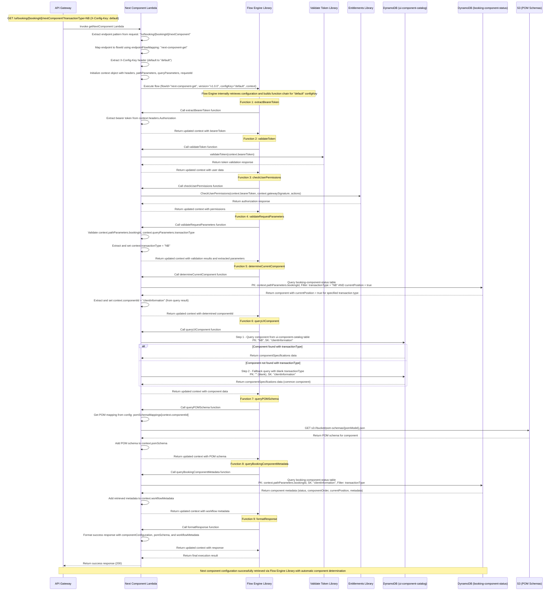
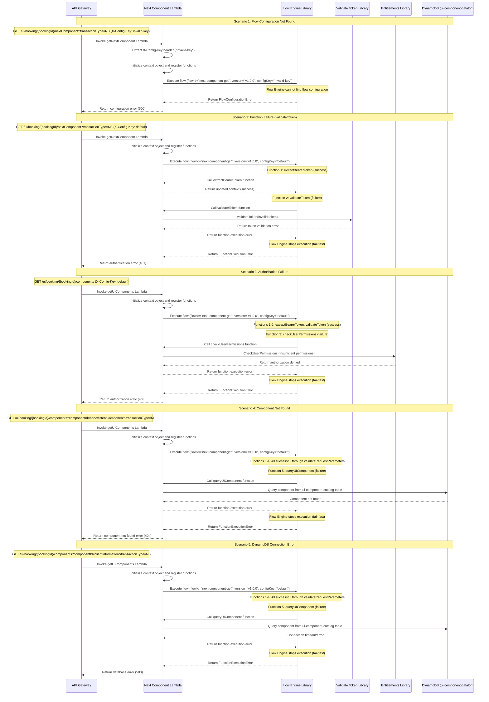
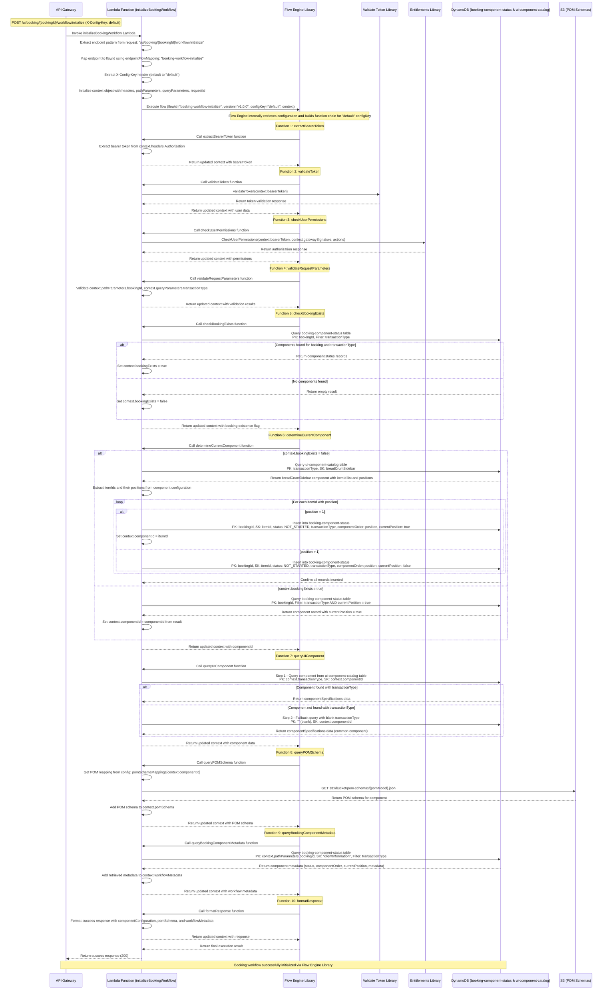
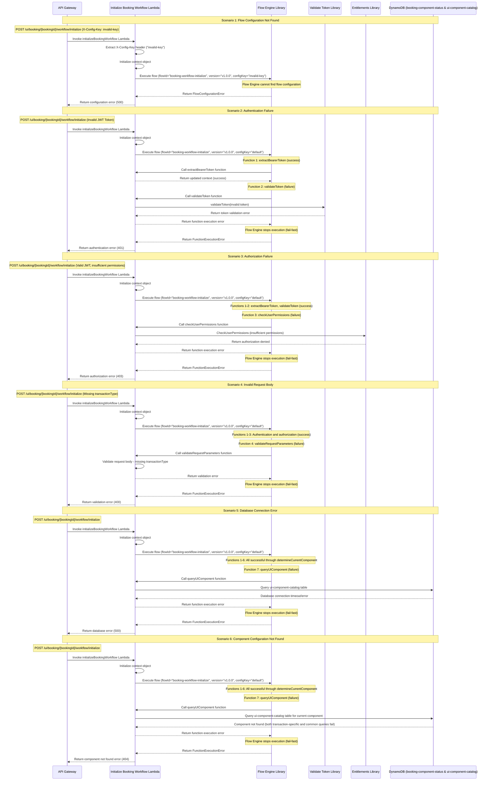
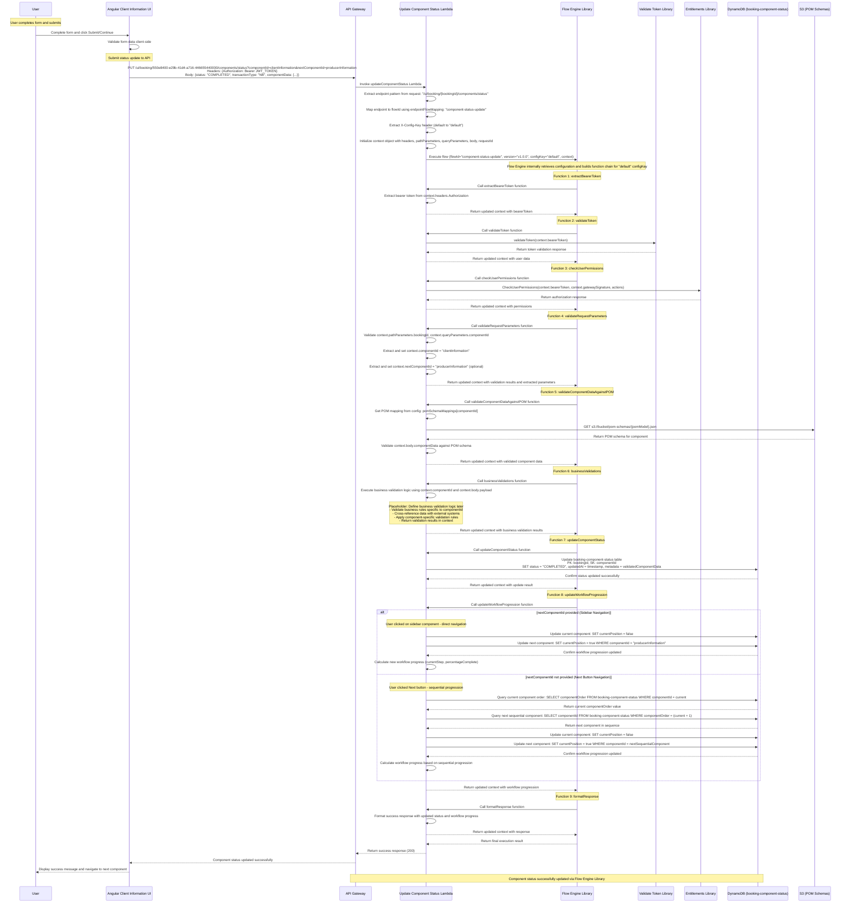
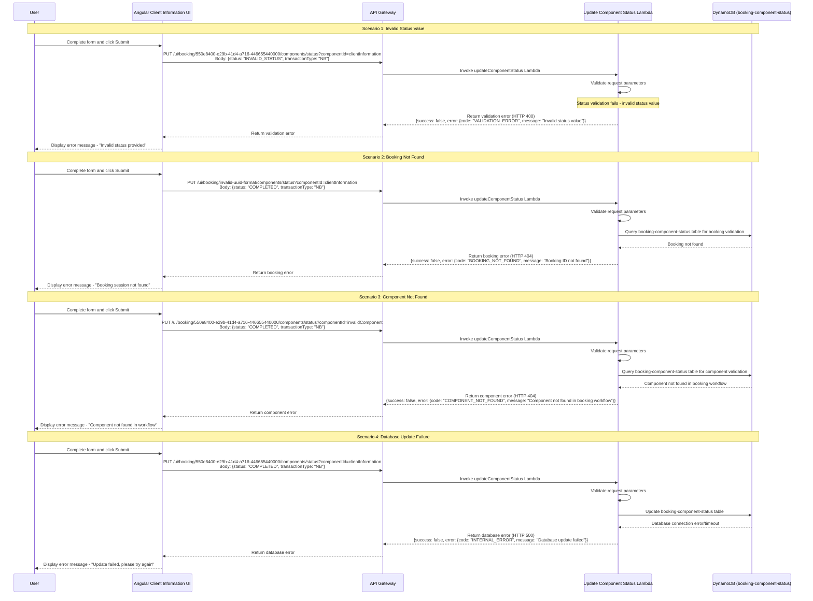

# Node.js Lambda Services Design for Dynamic UI System

## Table of Contents
1. [System Overview](#system-overview)
2. [Service Architecture](#service-architecture)
3. [Lambda Functions](#lambda-functions)
4. [Sequence Diagrams](#sequence-diagrams)
5. [Error Handling](#error-handling)
6. [Security](#security)
7. [Performance Optimization](#performance-optimization)
8. [Monitoring and Logging](#monitoring-and-logging)

## System Overview

This document outlines the design for Node.js Lambda services that support the Client Information UI workflow with four main endpoints for dynamic UI configurations, booking workflow management, and component status tracking.

### Supported Endpoints
1. **Next Component Endpoint**: `GET /ui/booking/{bookingId}/nextComponent?transactionType={transactionType}`
2. **Workflow Initialize Endpoint**: `POST /ui/booking/{bookingId}/workflow/initialize`
3. **Update Component Status Endpoint**: `PUT /ui/booking/{bookingId}/components/status?componentId={componentId}&nextComponentId={nextComponentId}` (optional)
4. **Get Component Endpoint**: `GET /ui/booking/{bookingId}/components?componentId={componentId}&transactionType={transactionType}`

### Key Features
- Dynamic UI component retrieval with booking context
- Booking workflow initialization and component status tracking
- Component status updates and workflow progression
- **POM Schema Integration**: Dynamic Policy Object Model schemas from S3
- **Zero-Hardcoded UI**: All data structures delivered from backend
- Transaction type-based component filtering
- Breadcrumb navigation support (header, footer, sidebar)
- External service integration URLs (MDM systems)
- Error handling and validation
- Security and authentication
- Monitoring and logging

## Service Architecture

### High-Level Architecture
```
API Gateway -> Lambda Functions -> DynamoDB
```

### Core Components
- **API Gateway**: Entry point for both UI components and current stage requests
- **Lambda Functions**: Business logic for component retrieval and stage tracking
- **DynamoDB**: UI component configuration storage and booking stage data
- **CloudWatch**: Monitoring and logging

### Endpoint Mapping
- **Next Component Service**: Handles `GET /ui/booking/{bookingId}/nextComponent` requests
- **Workflow Initialize Service**: Handles `POST /ui/booking/{bookingId}/workflow/initialize` requests
- **Update Component Status Service**: Handles `PUT /ui/booking/{bookingId}/components/status` requests
- **Get Component Service**: Handles `GET /ui/booking/{bookingId}/components` requests

## Configuration Management

### Complete config.json Structure

The Lambda service uses a comprehensive configuration file that includes endpoint-to-flow mappings, POM schema mappings, S3 configurations, and component mappings:

```json
{
  "apiEndpoints": {
    "nextComponent": "/ui/booking/{bookingId}/nextComponent?transactionType={transactionType}",
    "workflowInitialize": "/ui/booking/{bookingId}/workflow/initialize",
    "componentStatus": "/ui/booking/{bookingId}/components/status?componentId={componentId}&nextComponentId={nextComponentId}",
    "getComponent": "/ui/booking/{bookingId}/components?componentId={componentId}&transactionType={transactionType}"
  },
  "endpointFlowMapping": {
    "/ui/booking/{bookingId}/nextComponent": "next-component-get",
    "/ui/booking/{bookingId}/workflow/initialize": "booking-workflow-initialize",
    "/ui/booking/{bookingId}/components/status": "component-status-update",
    "/ui/booking/{bookingId}/components": "ui-components-get"
  },
  "componentMappings": {
    "header": "breadCrumHeader",
    "footer": "breadCrumFooter",
    "sidebar": "breadCrumSidebar"
  },
  "pomSchemaMappings": {
    "CLIENT_INFO": "Client",
    "POLICY_DETAILS": "Policy",
    "VEHICLE_INFO": "Vehicle",
    "COVERAGE_SELECTION": "Coverage",
    "DRIVER_INFO": "Driver",
    "BILLING_INFO": "Billing",
    "PAYMENT_INFO": "Payment",
    "CONTACT_INFO": "Contact"
  },
  "s3Configuration": {
    "bucketName": "${S3_POM_BUCKET}",
    "pomSchemaPrefix": "pom-schemas/",
    "region": "${AWS_REGION}",
    "cacheTimeout": 3600
  },
  "flowEngineConfig": {
    "defaultVersion": "v1.0.0",
    "defaultConfigKey": "default",
    "maxRetries": 3,
    "timeout": 30000
  },
  "dynamoDbTables": {
    "uiComponentCatalog": "ui-component-catalog",
    "bookingComponentStatus": "booking-component-status",
    "serviceFunctionFlows": "service-function-flows"
  },
  "cacheConfiguration": {
    "pomSchemaCache": {
      "enabled": true,
      "ttl": 3600,
      "maxSize": 100
    },
    "componentConfigCache": {
      "enabled": true,
      "ttl": 1800,
      "maxSize": 50
    }
  }
}
```

### Configuration Usage Patterns

#### **Runtime Endpoint Resolution**
```javascript
// Lambda function determines flowId from incoming request
const endpoint = extractEndpointPattern(event.requestContext.resourcePath);
const flowId = config.endpointFlowMapping[endpoint]; // "/ui/booking/{bookingId}/nextComponent" -> "next-component-get"
```

#### **POM Schema Resolution**
```javascript
// Get POM schema reference for component
const pomModel = config.pomSchemaMappings[componentId];
const s3Key = `${config.s3Configuration.pomSchemaPrefix}${pomModel}.json`;
```

#### **S3 Integration**
```javascript
// Load POM schema from S3 with caching
const pomSchema = await loadPOMSchemaFromS3({
  bucket: config.s3Configuration.bucketName,
  key: s3Key,
  region: config.s3Configuration.region,
  cacheTimeout: config.s3Configuration.cacheTimeout
});
```

## Lambda Functions

### 1. Get Next Component Service

**Function Name**: `getNextComponent`
**Purpose**: Automatically retrieve the next UI component for a booking session based on current workflow position

**Important Note**: Common functions used across multiple endpoints (such as `extractBearerToken`, `validateToken`, `checkUserPermissions`, `formatResponse`) should NOT be re-written within the Lambda. These functions should be implemented once and reused by the Flow Engine Library to maintain code consistency and reduce duplication.

#### API Endpoint Specification

**HTTP Method**: GET
**Endpoint**: `/ui/booking/{bookingId}/nextComponent`

**URL Structure**:
```
GET /ui/booking/{bookingId}/nextComponent?transactionType={transactionType}
```

**Request Parameters**:
- `bookingId` (path, required): Unique booking session identifier (e.g., "550e8400-e29b-41d4-a716-446655440000")
- `transactionType` (query, required): Transaction type identifier (e.g., "NB", "ENDORSEMENT", "RENEWAL")

**Request Headers**:
```json
{
  "Authorization": "Bearer {JWT_TOKEN}",
  "Content-Type": "application/json",
  "X-Config-Key": "default"
}
```

**Request Header Descriptions**:
- `Authorization` (required): Bearer JWT token for authentication
- `Content-Type` (required): Must be "application/json"
- `X-Config-Key` (optional): Flow configuration key (defaults to "default" if not provided)

#### Request Payload Specification

**HTTP Method**: GET
**Request Body**: None (GET request with query parameters only)

**Path Parameters**:
```json
{
  "bookingId": "string"
}
```

**Query Parameters**:
```json
{
  "transactionType": "string"
}
```

**Request Parameter Field Descriptions**:
- `bookingId` (string, required): Unique booking session identifier
  - Format: UUID (e.g., "550e8400-e29b-41d4-a716-446655440000")
  - Constraints: Must be valid booking ID from booking initiation
- `transactionType` (string, required): Transaction type identifier
  - Valid values: "NB", "ENDORSEMENT", "RENEWAL"
  - Constraints: Must match booking session transaction type

**Component Determination Logic**:
- The service automatically determines the current component by querying the `booking-component-status` table
- Looks for the component with `currentPosition = true` for the given booking ID and transaction type
- Uses the `transactionType` from the request parameter to filter the booking component status records
- No need to specify `componentId` in the request - it's determined dynamically based on workflow position and transaction type

#### Response Payload Specification

#### Success Response (HTTP 200)

**Note**: This response is constructed from direct DynamoDB table output. The `componentConfiguration` field contains the exact `componentSpecifications` attribute value retrieved from the `ui-component-catalog` table.

```json
{
  "success": true,
  "data": {
    "bookingId": "string",
    "componentId": "string",
    "componentConfiguration": {
    },
    "pomSchema": {
      "modelName": "string",
      "version": "string",
      "fields": {
      }
    },
    "workflowMetadata": {
      "currentStep": "number",
      "totalSteps": "number",
      "previousComponent": "string",
      "nextComponent": "string",
      "canGoBack": "boolean",
      "canProceed": "boolean"
    }
  },
  "timestamp": "string"
}
```

**Success Response Field Descriptions**:
- `success` (boolean): Operation success indicator (always true for success responses)
- `data` (object): Component configuration data retrieved from DynamoDB table `ui-component-catalog`
  - `bookingId` (string): Echo of the booking session identifier from request
  - `componentId` (string): Component identifier automatically determined based on `currentPosition = true` in booking-component-status table
  - `componentConfiguration` (object): Direct mapping of `componentSpecifications` attribute from DynamoDB ui-component-catalog table
    - **Note**: This object contains the exact `componentSpecifications` value from the matched DynamoDB record
    - Structure varies by component type - see `design/3. DynamoDB/dynamodb-specification.md` for complete examples
    - Common fields include:
      - `type` (string): Component type (e.g., "header", "footer", "form", "sidebar")
      - `layout` (string): Layout type (e.g., "horizontal", "vertical", "grid")
      - `backgroundColor` (string): Component background color
  - `pomSchema` (object): Policy Object Model schema retrieved from S3 for this component
    - `modelName` (string): POM model name (e.g., "Client", "Policy", "Vehicle")
    - `version` (string): Schema version from S3 object (e.g., "1.0.0")
    - `fields` (object): Complete field definitions with validation rules from POM schema
      - `fields` (array): Form fields configuration (for form components)
      - `sections` (array): Component sections (for complex components)
      - `buttons` (array): Button configurations (for footer/action components)
      - `styling` (object): CSS styling properties
  - `workflowMetadata` (object): Computed workflow navigation information
    - `currentStep` (number): Current workflow step number
    - `totalSteps` (number): Total number of steps in workflow
    - `previousComponent` (string): Previous component in workflow
    - `nextComponent` (string): Next component in workflow
    - `canGoBack` (boolean): Whether user can navigate back
    - `canProceed` (boolean): Whether user can proceed to next step
- `timestamp` (string): API response timestamp in ISO 8601 format

**Note**: The exact `componentConfiguration` structure varies based on the component type and is defined by the data retrieved from the DynamoDB `ui-component-catalog` table as specified in `design/3. DynamoDB/dynamodb-specification.md`

**DynamoDB Query Logic**: The Lambda service uses a three-step approach to determine and retrieve the current component:

**Step 1 - Determine Current Component**:
- Query `booking-component-status` table to find the component with `currentPosition = true`
- **Partition Key**: `bookingId` from path parameter
- **Filter Expression**: `transactionType = :transactionType AND currentPosition = :true`
- This identifies the currently active component for the specific transaction type

**Step 2 - Primary Component Query**:
- **Partition Key**: `transactionType` from request parameter (e.g., "NB")
- **Sort Key**: `componentId` determined from Step 1 (e.g., "clientInformation")

**Step 3 - Fallback Query** (if Step 2 returns no results):
- **Partition Key**: `""` (empty/blank string)
- **Sort Key**: `componentId` from Step 1 (same component, but common configuration)

**Query Priority**:
1. First, determine the current component based on `currentPosition = true` for the specified transactionType
2. Attempt to retrieve component configuration with the specified `transactionType`
3. If no record found, fall back to retrieve component with blank `transactionType` (common components)
4. This ensures transaction-specific components take precedence over generic components

**Response Mapping**:
- `componentConfiguration` = `componentSpecifications` attribute from the matched DynamoDB record
- The exact structure depends on the component type and is defined in `design/3. DynamoDB/dynamodb-specification.md`

#### Error Response (HTTP 4xx/5xx)

```json
{
  "success": false,
  "error": {
    "code": "string",
    "message": "string",
    "details": "string"
  },
  "timestamp": "string"
}
```

**Error Response Field Descriptions**:
- `success` (boolean): Operation success indicator (always false for error responses)
- `error` (object): Error information for failed requests
  - `code` (string): Error code identifier
    - `VALIDATION_ERROR`: Invalid request parameters
    - `BOOKING_NOT_FOUND`: Booking ID not found or invalid
    - `COMPONENT_NOT_FOUND`: Component ID not found in catalog
    - `UNAUTHORIZED`: Authentication failure or invalid JWT token
    - `FORBIDDEN`: Insufficient permissions for component access
    - `INTERNAL_ERROR`: Server-side error or database issues
    - `TIMEOUT`: Request processing timeout
    - `FLOW_CONFIG_ERROR`: Flow configuration not found
  - `message` (string): Human-readable error message
  - `details` (string): Additional error context for debugging
- `timestamp` (string): Error response timestamp in ISO 8601 format

**Response Format**: JSON object containing dynamic UI component configurations with booking context and workflow metadata


### 2. Initialize Booking Workflow Service

**Function Name**: `initializeBookingWorkflow`
**Purpose**: Initialize booking workflow, determine current component, and retrieve component configuration with workflow metadata

#### API Endpoint Specification

**HTTP Method**: POST
**Endpoint**: `/ui/booking/{bookingId}/workflow/initialize`

**Request Parameters**:
- `bookingId` (path, required): Unique booking session identifier (e.g., "550e8400-e29b-41d4-a716-446655440000")

**Request Headers**:
```json
{
  "Authorization": "Bearer {JWT_TOKEN}",
  "Content-Type": "application/json",
  "X-Config-Key": "default"
}
```

**Request Header Descriptions**:
- `Authorization` (required): Bearer JWT token for authentication
- `Content-Type` (required): Must be "application/json"
- `X-Config-Key` (optional): Flow configuration key (defaults to "default" if not provided)

#### Request Payload Specification

**Request Body**:
```json
{
  "transactionType": "NB"
}
```

**Request Body Field Descriptions**:
- `transactionType` (string, required): Transaction type identifier (e.g., "NB", "ENDORSEMENT", "RENEWAL")


#### Response Payload Specification

#### Success Response (HTTP 200)

```json
{
  "success": true,
  "data": {
    "bookingId": "string",
    "componentConfiguration": {
      "componentId": "string",
      "formFields": [],
      "actionUrls": {},
      "layout": {}
    },
    "pomSchema": {
      "modelName": "string",
      "version": "string",
      "fields": {}
    },
    "workflowMetadata": {
      "currentStep": "number",
      "totalSteps": "number",
      "percentageComplete": "number",
      "componentStatus": "string",
      "allowedActions": ["string"]
    }
  },
  "timestamp": "string"
}
```

**Success Response Field Descriptions**:
- `success` (boolean): Operation success indicator (always true for success responses)
- `data` (object): Workflow initialization result with current component configuration
  - `bookingId` (string): Echo of the booking session identifier from request
  - `componentConfiguration` (object): Current component configuration from ui-component-catalog table
    - `componentId` (string): Current component identifier determined by workflow logic
    - `formFields` (array): Form field definitions for dynamic UI generation
    - `actionUrls` (object): External service integration URLs (e.g., MDM services)
    - `layout` (object): Component layout and styling information
  - `pomSchema` (object): Policy Object Model schema from S3 for current component
    - `modelName` (string): POM model name (e.g., "Client", "Policy", "Vehicle")
    - `version` (string): Schema version from S3 object
    - `fields` (object): Complete field definitions with validation rules
  - `workflowMetadata` (object): Workflow progress and status information
    - `currentStep` (number): Current step number in overall workflow
    - `totalSteps` (number): Total number of steps in complete workflow
    - `percentageComplete` (number): Workflow completion percentage (0-100)
    - `componentStatus` (string): Current component status ("NOT_STARTED", "IN_PROGRESS", "COMPLETED")
    - `allowedActions` (array of strings): Available workflow actions
- `timestamp` (string): API response timestamp in ISO 8601 format

**Note**: The exact response structure is defined by the booking stage data source and should be specified in the corresponding table schema design.

**Data Source**: The Lambda service retrieves booking stage information from the appropriate data source using the provided `bookingId`.

#### Error Response (HTTP 4xx/5xx)

```json
{
  "success": false,
  "error": {
    "code": "string",
    "message": "string",
    "details": "string"
  },
  "timestamp": "string"
}
```

**Error Response Field Descriptions**:
- `success` (boolean): Operation success indicator (always false for error responses)
- `error` (object): Error information for failed requests
  - `code` (string): Error code identifier
    - `VALIDATION_ERROR`: Invalid request parameters
    - `BOOKING_NOT_FOUND`: Booking ID not found or invalid
    - `BOOKING_STAGE_NOT_FOUND`: No stage information available for booking
    - `UNAUTHORIZED`: Authentication failure or invalid JWT token
    - `FORBIDDEN`: Insufficient permissions for stage access
    - `INTERNAL_ERROR`: Server-side error or data source issues
    - `TIMEOUT`: Request processing timeout
    - `FLOW_CONFIG_ERROR`: Flow configuration not found
  - `message` (string): Human-readable error message
  - `details` (string): Additional error context for debugging
- `timestamp` (string): Error response timestamp in ISO 8601 format

**Response Format**: JSON object containing current booking stage information and workflow progress data

### 3. Update Component Status Service

**Function Name**: `updateComponentStatus`
**Purpose**: Update component status in booking-component-status table and manage workflow progression

#### API Endpoint Specification

**HTTP Method**: PUT
**Endpoint**: `/ui/booking/{bookingId}/components/status`

**Request Parameters**:
- `bookingId` (path, required): Unique booking session identifier (e.g., "550e8400-e29b-41d4-a716-446655440000")
- `componentId` (query, required): Current component identifier being updated
- `nextComponentId` (query, optional): Next component identifier for workflow progression
  - **Usage**:
    - **Sidebar Navigation**: When user clicks a sidebar component, provide the componentId of the clicked element
    - **Next Button Navigation**: When user clicks "Next" button, leave this field blank/empty - Lambda will determine next component using componentOrder

**Request Headers**:
```json
{
  "Authorization": "Bearer {JWT_TOKEN}",
  "Content-Type": "application/json",
  "X-Config-Key": "default"
}
```

**Request Header Descriptions**:
- `Authorization` (required): Bearer JWT token for authentication
- `Content-Type` (required): Must be "application/json"
- `X-Config-Key` (optional): Flow configuration key (defaults to "default" if not provided)

#### Request Payload Specification

**Request Body**:
```json
{
  "status": "COMPLETED",
  "transactionType": "NB",
  "componentData": {
    "firstName": "John",
    "lastName": "Doe",
    "email": "john.doe@email.com",
    "dateOfBirth": "1990-01-15",
    "phoneNumber": "+1-555-123-4567"
  }
}
```

**Request Body Field Descriptions**:
- `status` (string, required): Component status update ("IN_PROGRESS", "COMPLETED", "NOT_STARTED")
- `transactionType` (string, required): Transaction type identifier (e.g., "NB", "ENDORSEMENT", "RENEWAL")
- `componentData` (object, required): Component form data following POM schema structure
  - **Note**: This object must conform to the POM schema for the specified componentId
  - Structure varies by component (e.g., CLIENT_INFO uses "Client" POM model)
  - Validated against S3-stored POM schema before processing

#### Response Payload Specification

#### Success Response (HTTP 200)

```json
{
  "success": true,
  "data": {
    "bookingId": "550e8400-e29b-41d4-a716-446655440000",
    "componentId": "CLIENT_INFO",
    "status": "COMPLETED",
    "nextComponentId": "POLICY_DETAILS",
    "updatedAt": "2024-01-15T10:30:00Z",
    "workflowProgress": {
      "currentStep": 3,
      "totalSteps": 5,
      "percentageComplete": 60
    }
  },
  "timestamp": "2024-01-15T10:30:00Z"
}
```

**Success Response Field Descriptions**:
- `success` (boolean): Operation success indicator (always true for success responses)
- `data` (object): Component status update result data
  - `bookingId` (string): Unique booking session identifier
  - `componentId` (string): Updated component identifier
  - `status` (string): New component status
  - `nextComponentId` (string): Next component in workflow (if applicable)
  - `updatedAt` (string): ISO 8601 timestamp of status update
  - `workflowProgress` (object): Current workflow progress information
- `timestamp` (string): API response timestamp in ISO 8601 format

#### Error Response (HTTP 4xx/5xx)

```json
{
  "success": false,
  "error": {
    "code": "string",
    "message": "string",
    "details": "string"
  },
  "timestamp": "string"
}
```

**Error Response Field Descriptions**:
- `success` (boolean): Operation success indicator (always false for error responses)
- `error` (object): Error information for failed requests
  - `code` (string): Error code identifier
    - `VALIDATION_ERROR`: Invalid request parameters or status values
    - `BOOKING_NOT_FOUND`: Booking ID not found or invalid
    - `COMPONENT_NOT_FOUND`: Component ID not found in booking workflow
    - `UNAUTHORIZED`: Authentication failure or invalid JWT token
    - `FORBIDDEN`: Insufficient permissions for status updates
    - `INTERNAL_ERROR`: Server-side error or database issues
    - `TIMEOUT`: Request processing timeout
    - `FLOW_CONFIG_ERROR`: Flow configuration not found
  - `message` (string): Human-readable error message
  - `details` (string): Additional error context for debugging
- `timestamp` (string): Error response timestamp in ISO 8601 format

**Response Format**: JSON object containing updated component status and workflow progression data

### Navigation Patterns and API Usage

The Update Component Status endpoint supports two distinct navigation patterns based on how the user interacts with the UI:

#### 1. Sidebar Component Navigation
**User Action**: User clicks on a specific component in the sidebar (e.g., "Policy Details", "Vehicle Information")

**API Call Pattern**:
```
PUT /ui/booking/{bookingId}/components/status?componentId={currentComponent}&nextComponentId={clickedComponent}
```

**Example**:
```
PUT /ui/booking/550e8400-e29b-41d4-a716-446655440000/components/status?componentId=CLIENT_INFO&nextComponentId=POLICY_DETAILS
Body: {
  "status": "COMPLETED",
  "transactionType": "NB",
  "componentData": { ... }
}
```

**Lambda Behavior**:
- Updates current component status to "COMPLETED"
- Sets `currentPosition = false` for current component
- Sets `currentPosition = true` for the clicked component (nextComponentId)
- Performs direct navigation to the specified component
- Recalculates workflow progress based on new current position

#### 2. Next Button Navigation
**User Action**: User clicks the "Next" button to proceed sequentially through the workflow

**API Call Pattern**:
```
PUT /ui/booking/{bookingId}/components/status?componentId={currentComponent}
```
*Note: No `nextComponentId` parameter provided*

**Example**:
```
PUT /ui/booking/550e8400-e29b-41d4-a716-446655440000/components/status?componentId=CLIENT_INFO
Body: {
  "status": "COMPLETED",
  "transactionType": "NB",
  "componentData": { ... }
}
```

**Lambda Behavior**:
- Updates current component status to "COMPLETED"
- Queries `componentOrder` from booking-component-status table for current component
- Determines next component by finding componentOrder + 1
- Sets `currentPosition = false` for current component
- Sets `currentPosition = true` for next sequential component
- Maintains sequential workflow progression
- Recalculates workflow progress based on sequential advancement

This dual-pattern approach provides:
- **Flexible Navigation**: Users can jump directly to any workflow step via sidebar
- **Guided Workflow**: Users can follow the intended sequential flow via Next button
- **Consistent API**: Same endpoint handles both navigation methods intelligently
- **Automatic Progression**: Lambda determines appropriate next step based on context

### 4. Get Component Service

**Function Name**: `getComponent`
**Purpose**: Retrieve specific UI component configuration by componentId and transactionType

**Important Note**: Common functions used across multiple endpoints (such as `extractBearerToken`, `validateToken`, `checkUserPermissions`, `formatResponse`) should NOT be re-written within the Lambda. These functions should be implemented once and reused by the Flow Engine Library to maintain code consistency and reduce duplication.

#### API Endpoint Specification

**HTTP Method**: GET
**Endpoint**: `/ui/booking/{bookingId}/components`

**URL Structure**:
```
GET /ui/booking/{bookingId}/components?componentId={componentId}&transactionType={transactionType}
```

**Request Parameters**:
- `bookingId` (path, required): Unique booking session identifier (e.g., "550e8400-e29b-41d4-a716-446655440000")
- `componentId` (query, required): Component identifier to retrieve (e.g., "clientInformation", "producerInformation")
- `transactionType` (query, required): Transaction type identifier (e.g., "NB", "ENDORSEMENT", "RENEWAL")

**Request Headers**:
```json
{
  "Authorization": "Bearer {JWT_TOKEN}",
  "Content-Type": "application/json",
  "X-Config-Key": "default"
}
```

**Header Field Descriptions**:
- `Authorization` (required): Bearer JWT token for authentication
- `Content-Type` (required): Must be "application/json"
- `X-Config-Key` (optional): Flow configuration key (defaults to "default" if not provided)

#### Request Payload Specification

**HTTP Method**: GET
**Request Body**: None (GET request with query parameters only)

**Path Parameters**:
```json
{
  "bookingId": "string"
}
```

**Query Parameters**:
```json
{
  "componentId": "string",
  "transactionType": "string"
}
```

**Request Parameter Field Descriptions**:
- `bookingId` (string, required): Unique booking session identifier
  - Format: UUID (e.g., "550e8400-e29b-41d4-a716-446655440000")
  - Constraints: Must be valid booking ID from booking initiation
- `componentId` (string, required): Component identifier to retrieve
  - Valid values: "breadCrumHeader", "breadCrumFooter", "breadCrumSidebar", "clientInformation", "producerInformation"
  - Constraints: Must exist in ui-component-catalog table
- `transactionType` (string, required): Transaction type identifier
  - Valid values: "NB", "ENDORSEMENT", "RENEWAL"
  - Constraints: Must match booking session transaction type

#### Response Payload Specification

#### Success Response (HTTP 200)

```json
{
  "success": true,
  "data": {
    "bookingId": "string",
    "componentId": "string",
    "componentConfiguration": {
    },
    "pomSchema": {
      "modelName": "string",
      "version": "string",
      "fields": {}
    },
    "workflowMetadata": {
      "currentStep": "number",
      "totalSteps": "number",
      "percentageComplete": "number",
      "componentStatus": "string",
      "allowedActions": []
    }
  },
  "timestamp": "string"
}
```

**Success Response Field Descriptions**:
- `success` (boolean): Operation success indicator (always true for success responses)
- `data` (object): Component configuration data retrieved from DynamoDB table `ui-component-catalog`
  - `bookingId` (string): Echo of the booking session identifier from request
  - `componentId` (string): Component identifier from request query parameter
  - `componentConfiguration` (object): Direct mapping of `componentSpecifications` attribute from DynamoDB ui-component-catalog table
    - **Note**: This object contains the exact `componentSpecifications` value from the matched DynamoDB record
    - Structure varies by component type - see `design/3. DynamoDB/dynamodb-specification.md` for complete examples
  - `pomSchema` (object): Policy Object Model schema for dynamic payload generation
  - `workflowMetadata` (object): Booking workflow information and component status
- `timestamp` (string): API response timestamp in ISO 8601 format

**DynamoDB Query Logic**: The Lambda service uses a two-step approach to retrieve the specific component:

**Step 1 - Primary Component Query**:
- **Partition Key**: `transactionType` from request parameter (e.g., "NB")
- **Sort Key**: `componentId` from request parameter (e.g., "clientInformation")

**Step 2 - Fallback Query** (if Step 1 returns no results):
- **Partition Key**: `""` (empty/blank string)
- **Sort Key**: `componentId` from request parameter (same component, but common configuration)

**Query Priority**:
1. Attempt to retrieve component configuration with the specified `transactionType`
2. If no record found, fall back to retrieve component with blank `transactionType` (common components)
3. This ensures transaction-specific components take precedence over generic components

#### Error Response (HTTP 4xx/5xx)
```json
{
  "success": false,
  "error": {
    "code": "ERROR_CODE",
    "message": "Error message",
    "details": "Additional error details"
  },
  "timestamp": "2024-01-15T10:05:00Z"
}
```

**Error Response Field Descriptions**:
- `success` (boolean): Operation success indicator (always false for errors)
- `error` (object): Error information
  - `code` (string): Error code identifier
    - `BOOKING_NOT_FOUND`: Booking ID not found or invalid
    - `COMPONENT_NOT_FOUND`: Component ID not found
    - `UNAUTHORIZED`: Authentication failure
    - `FORBIDDEN`: Insufficient permissions
    - `VALIDATION_ERROR`: Invalid parameters
    - `INTERNAL_ERROR`: Server-side error
  - `message` (string): Human-readable error message
  - `details` (string): Additional error context for debugging
- `timestamp` (string): Error response timestamp in ISO 8601 format

## Sequence Diagrams

### Endpoint 1: Get Next Component - Success Scenario



### Endpoint 1: Get Next Component - Failure Scenarios



### Endpoint 2: Initialize Booking Workflow - Success Scenario



### Endpoint 2: Initialize Booking Workflow - Failure Scenarios



### Endpoint 3: Update Component Status - Success Scenario



### Endpoint 3: Update Component Status - Failure Scenarios



## API Gateway Integration

### API Gateway Configuration
- CORS configuration for cross-origin requests
- Request/response transformation
- Authentication and authorization integration
- Rate limiting and throttling

## Error Handling

### Error Types and Handling Strategy
- **ComponentNotFoundError (404)**: When requested component doesn't exist
- **ValidationError (400)**: Invalid request parameters or component data
- **AuthenticationError (401)**: Missing or invalid JWT token
- **AuthorizationError (403)**: Insufficient permissions
- **InternalServerError (500)**: Database connection issues or unexpected errors
- **TimeoutError (504)**: Lambda function or DynamoDB timeout

### Validation Rules
- Transaction type validation (required parameter)
- Component ID format validation
- Component data structure validation
- Required field validation for updates
- JSON schema validation for component specifications

## Security

### Authentication and Authorization
- JWT token validation for all requests
- Role-based access control (RBAC)
- Permission-based resource access
- User context extraction from tokens

### Configuration

#### Flow Engine Configuration
The Lambda service uses a configuration mapping to determine which Flow Engine flowId to execute based on the incoming request endpoint:

```json
{
  "endpointFlowMapping": {
    "/ui/booking/{bookingId}/nextComponent": "next-component-get",
    "/ui/booking/{bookingId}/workflow/initialize": "booking-workflow-initialize",
    "/ui/booking/{bookingId}/components/status": "component-status-update"
  },
  "flowEngineConfig": {
    "defaultVersion": "v1.0.0",
    "defaultConfigKey": "default",
    "maxRetries": 3,
    "timeout": 30000
  }
}
```

**Usage**: The Lambda function extracts the endpoint pattern from the incoming request and maps it to the corresponding flowId. This flowId is then passed to the Flow Engine Library along with the version and configKey to execute the appropriate function chain.

### Environment Variables
- **DYNAMODB_TABLE_NAME**: DynamoDB table name for ui-component-catalog
- **FLOW_CONFIG_TABLE_NAME**: DynamoDB table name for service-function-flows (default: service-function-flows)
- **AWS_REGION**: AWS region for services
- **JWT_SECRET**: Secret key for JWT validation
- **LOG_LEVEL**: Logging level (info, debug, error)
- **DEFAULT_FLOW_VERSION**: Default flow version (default: v1.0.0)
- **DEFAULT_CONFIG_KEY**: Default config key when X-Config-Key header is missing (default: default)

## Performance Optimization

### DynamoDB Optimization
- Optimized query operations with proper key conditions
- Connection pooling and retry logic
- Exponential backoff for failed requests
- Projection expressions for minimal data transfer
- Batch operations for multiple component requests

## Monitoring and Logging

### CloudWatch Integration
- Structured JSON logging with request correlation IDs
- Automatic Lambda function metrics (duration, errors, invocations)
- Custom business metrics publishing
- Log aggregation and search capabilities
- Real-time monitoring dashboards

### Custom Metrics

- **ComponentRequests**: Number of component retrieval requests
- **ComponentErrors**: Error rate by type
- **ResponseTime**: Average response time
- **DynamoDBLatency**: Database operation latency

This design provides a robust, scalable foundation for the Node.js Lambda services that will power your dynamic UI system, with proper error handling, security, and monitoring capabilities.