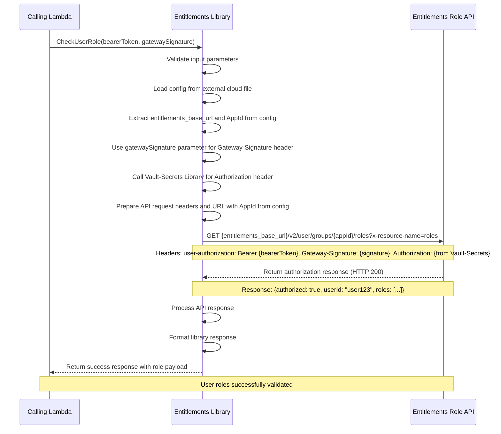
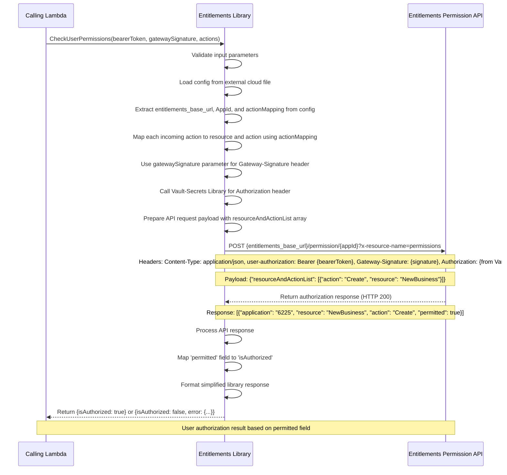
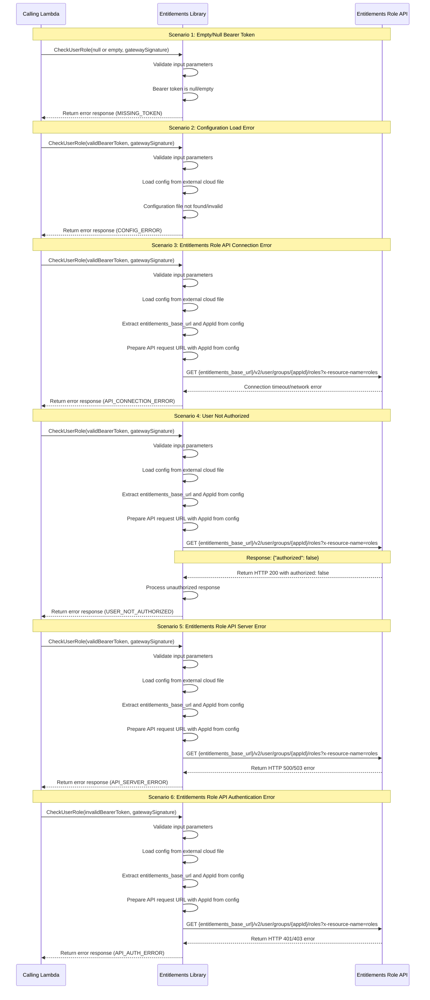

# Entitlements Library Function Design

## Table of Contents
1. [System Overview](#system-overview)
2. [Function Architecture](#function-architecture)
3. [Function Specification](#function-specification)
4. [Sequence Diagrams](#sequence-diagrams)
5. [Error Handling](#error-handling)
6. [Security](#security)
7. [Performance Optimization](#performance-optimization)
8. [Monitoring and Logging](#monitoring-and-logging)

## System Overview

This document outlines the design for the Entitlements Library function, a common reusable Lambda library function that checks user roles and permissions based on JWT bearer tokens for authorization across multiple services in the system.

### Technology Stack Compatibility
- **Runtime**: Node.js 20.x (compatible with master TDD backend architecture)
- **Language**: TypeScript 5.4.x
- **Package Manager**: npm 10.x
- **AWS SDK**: v3.x (optimized for Node.js 20.x)
- **HTTP Client**: Axios or AWS SDK HTTP client
- **Testing Framework**: Jest (compatible with Node.js 20.x)
- **JWT Libraries**: jsonwebtoken, jwt-decode (Node.js 20.x compatible)

### Key Features
- User role and permission validation
- Bearer token-based authorization checking
- Integration with external authorization systems
- Reusable across multiple Lambda services
- Standardized authorization responses
- Security best practices implementation
- Role-based access control (RBAC)

## Function Architecture

### High-Level Architecture
```
Calling Lambda -> Entitlements Library -> External Entitlements Role API -> Authorization Response
                                      -> Configuration Management
                                      -> Vault-Secrets Library
                                      -> validateToken Library Response
```

### Core Components
- **Bearer Token Processing**: Extract user information from JWT bearer token
- **External API Integration**: Authorization service integration for role checking
- **Configuration Management**: Environment-specific authorization service configuration
- **Vault-Secrets Integration**: Authorization header retrieval from Vault-Secrets Library
- **Token Integration**: Gateway signature extraction from validateToken response
- **Role Validation Logic**: User role and permission verification
- **Error Handling**: Standardized error responses for authorization failures
- **Logging**: Security audit trail and authorization monitoring

## Function Specification

### Library Function Details

**Library Functions**: `CheckUserRole` and `CheckUserPermissions`
**Type**: Lambda Library Functions (shared across services)
**Purpose**: Validate user roles and permissions using bearer token for authorization

### Configuration Management

**Config File Structure** (per environment):
```json
{
  "entitlements_base_url": "https://entitlement-api-v1-uat.uat.ss.hip10.npuweks.us-east-1.aws.aig.net/api",
  "AppId": "7454",
  "actionMapping": {
    "Create-New-Business": {
      "resource": "NewBusiness",
      "action": "Create"
    }
  }
}
```

**Environment-Specific Config Files**:
- External cloud config files stored outside the codebase
- Loaded at runtime when the entitlements library is initialized
- **dev-config.json**: Contains dev environment authorization service base URL
- **uat-config.json**: Contains UAT environment authorization service base URL
- **prod-config.json**: Contains prod environment authorization service base URL

**API Endpoints**:
- `{Entitlements-Role-API-Base-url}/v2/user/groups/{AppId}/roles?x-resource-name=roles` (CheckUserRole)
- `{Entitlements-Role-API-Base-url}/permission/{AppId}?x-resource-name=permissions` (CheckUserPermissions)

### Input Specification

#### CheckUserRole Function

**Function Parameters**:
```json
{
  "bearerToken": "string",
  "gatewaySignature": "string"
}
```

**Parameter Descriptions**:
- `bearerToken` (required): JWT bearer token containing user information
  - Type: string
  - Constraints: Non-empty, valid JWT format
- `gatewaySignature` (required): Gateway signature from validate token library success response
  - Type: string
  - Constraints: Non-empty, valid signature format

#### CheckUserPermissions Function

**Function Parameters**:
```json
{
  "bearerToken": "string",
  "gatewaySignature": "string",
  "actions": ["string"]
}
```

**Parameter Descriptions**:
- `bearerToken` (required): JWT bearer token containing user information
  - Type: string
  - Constraints: Non-empty, valid JWT format
- `gatewaySignature` (required): Gateway signature from validate token library success response
  - Type: string
  - Constraints: Non-empty, valid signature format
- `actions` (required): Array of actions being requested for permission check
  - Type: array of strings
  - Constraints: Non-empty array, each action must have corresponding mapping in config file

### External API Request Specification

#### CheckUserRole API Request

**HTTP Method**: GET
**Endpoint**: `{entitlements_base_url}/v2/user/groups/{appId}/roles?x-resource-name=roles`
**Headers**:
- `user-authorization`: Bearer {bearerToken}
- `Gateway-Signature`: {gatewaySignature parameter}
- `Authorization`: {retrieved from Vault-Secrets Library}

**Path Parameters**:
- `appId`: Application identifier loaded from config file (value: "7454")

**Query Parameters**:
- `x-resource-name`: Fixed value "roles"

**Request Field Descriptions**:
- `bearerToken`: Bearer token for user identification (in user-authorization header)
- `gatewaySignature`: Gateway signature passed as parameter from validateToken library response (in Gateway-Signature header)
- `Authorization`: Authorization header retrieved from Vault-Secrets Library
- `appId`: Application ID loaded from config file and used in URL path (value: "7454")

#### CheckUserPermissions API Request

**HTTP Method**: POST
**Endpoint**: `{entitlements_base_url}/permission/{appId}?x-resource-name=permissions`
**Headers**:
- `Content-Type`: application/json
- `user-authorization`: Bearer {bearerToken}
- `Gateway-Signature`: {gatewaySignature parameter}
- `Authorization`: {retrieved from Vault-Secrets Library}

**Path Parameters**:
- `appId`: Application identifier loaded from config file (value: "7454")

**Query Parameters**:
- `x-resource-name`: Fixed value "permissions"

**Request Payload**:
```json
{
  "resourceAndActionList": [
    {
      "action": "string",
      "resource": "string"
    }
  ]
}
```

**Request Field Descriptions**:
- `bearerToken`: Bearer token for user identification (in user-authorization header)
- `gatewaySignature`: Gateway signature passed as parameter from validateToken library response (in Gateway-Signature header)
- `Authorization`: Authorization header retrieved from Vault-Secrets Library
- `appId`: Application ID loaded from config file and used in URL path (value: "7454")
- `resourceAndActionList`: Array containing resource and action mappings retrieved from config file based on incoming actions array parameter
- `action`: Mapped action value from config file actionMapping for each incoming action
- `resource`: Mapped resource value from config file actionMapping for each incoming action

### External API Response Specification

#### CheckUserRole API Response

**Success Response from Entitlements Role API (HTTP 200)**:
```json
{
  "userId": "string",
  "userName": "string",
  "firstName": "string",
  "lastName": "string",
  "emailAddress": "string",
  "employeeId": "string",
  "managerId": "string",
  "deleteIn": "string",
  "isoCountryCd": "string",
  "userTypeCd": "string",
  "createUserId": "string",
  "createTs": "string",
  "updateUserId": "string",
  "updateTs": "string",
  "groupItems": [
    {
      "group": {
        "groupId": "number",
        "groupName": "string",
        "parentGroupId": "number",
        "groupDescription": "string",
        "nickName": "string",
        "groupType": "string",
        "defaultFlag": "string",
        "nextlabEntity": "null",
        "entities": []
      },
      "roles": [
        {
          "roleId": "number",
          "roleName": "string",
          "roleDescription": "string",
          "deleteIn": "string",
          "createUserId": "string",
          "createTs": "string",
          "updateUserId": "string",
          "updateTs": "string"
        }
      ]
    }
  ]
}
```

**CheckUserRole API Response Field Descriptions**:

**Root Level Properties**:
- `userId`: User's email/ID
- `userName`: Display username
- `firstName`: User's first name
- `lastName`: User's last name
- `emailAddress`: Email address
- `employeeId`: Employee identifier
- `managerId`: Manager's ID (can be "NULL")
- `deleteIn`: Delete indicator ("N"/"Y")
- `isoCountryCd`: ISO country code
- `userTypeCd`: User type code (e.g., "BOT")
- `createUserId`: User who created the record
- `createTs`: Creation timestamp (YYYY-MM-DD)
- `updateUserId`: User who last updated
- `updateTs`: Update timestamp (YYYY-MM-DD)
- `groupItems`: Array of group item objects

**GroupItem Structure**:
- `group`: Group details object
- `roles`: Array of role objects assigned to this group

**Group Object Properties**:
- `groupId`: Unique group identifier
- `groupName`: Group name/code
- `parentGroupId`: Parent group ID (optional for hierarchical structure)
- `groupDescription`: Description of the group
- `nickName`: Display name/nickname
- `groupType`: Type (APP, COUNTRY, MLOB, BU)
- `defaultFlag`: Default indicator ("N"/"Y")
- `nextlabEntity`: Next lab entity reference (typically null)
- `entities`: Nested entities array (supports recursive hierarchical structure)

**Role Object Properties**:
- `roleId`: Unique role identifier
- `roleName`: Role name
- `roleDescription`: Role description
- `deleteIn`: Delete indicator ("N"/"Y")
- `createUserId`: Creator user ID
- `createTs`: Creation timestamp (YYYY-MM-DD)
- `updateUserId`: Last updater user ID (can be null)
- `updateTs`: Update timestamp (YYYY-MM-DD, can be null)

#### CheckUserPermissions API Response

**Success Response from Entitlements Role API (HTTP 200)**:
```json
[
  {
    "application": "string",
    "resource": "string",
    "action": "string",
    "permitted": "boolean"
  }
]
```

**CheckUserPermissions API Response Field Descriptions**:
- `application`: Application identifier (e.g., "6225")
- `resource`: Resource name being checked for permissions
- `action`: Action being performed on the resource
- `permitted`: Boolean indicating if the user has permission for this resource/action combination

#### Common Error Response (HTTP 4xx/5xx)

**Error Response from Entitlements Role API**:
```json
{
  "authorized": "boolean",
  "error": {
    "code": "string",
    "message": "string"
  }
}
```

### Library Function Output Specification

#### CheckUserRole Library Response

**Success Response**:
```json
{
  "isAuthorized": "boolean",
  "payload": {
    "userId": "string",
    "userName": "string",
    "firstName": "string",
    "lastName": "string",
    "emailAddress": "string",
    "employeeId": "string",
    "managerId": "string",
    "deleteIn": "string",
    "isoCountryCd": "string",
    "userTypeCd": "string",
    "createUserId": "string",
    "createTs": "string",
    "updateUserId": "string",
    "updateTs": "string",
    "groupItems": [
      {
        "group": {
          "groupId": "number",
          "groupName": "string",
          "parentGroupId": "number",
          "groupDescription": "string",
          "nickName": "string",
          "groupType": "string",
          "defaultFlag": "string",
          "nextlabEntity": "null",
          "entities": []
        },
        "roles": [
          {
            "roleId": "number",
            "roleName": "string",
            "roleDescription": "string",
            "deleteIn": "string",
            "createUserId": "string",
            "createTs": "string",
            "updateUserId": "string",
            "updateTs": "string"
          }
        ]
      }
    ]
  }
}
```

#### CheckUserPermissions Library Response

**Success Response** (when permitted: true):
```json
{
  "isAuthorized": true
}
```

**Error Response** (when permitted: false or any error condition):
```json
{
  "isAuthorized": false,
  "error": {
    "code": "string",
    "message": "string",
    "details": "string"
  }
}
```

#### Common Error Response

**Error Response**:
```json
{
  "isAuthorized": "boolean",
  "error": {
    "code": "string",
    "message": "string",
    "details": "string"
  }
}
```

**Library Success Response Field Descriptions**:
- `isAuthorized`: Boolean mapped from API response `permitted` field - true when user has permission, false otherwise

**Library Error Response Field Descriptions**:
- `isAuthorized`: Boolean indicating authorization result
- `error.code`: Error type identifier
- `error.message`: Human-readable error description
- `error.details`: Additional error context from API response

## Sequence Diagrams

### Success Scenario - CheckUserRole Function



### Success Scenario - CheckUserPermissions Function



### Failure Scenarios



## Error Handling

### Error Types and Handling Strategy
- **MISSING_TOKEN**: Bearer token is null, undefined, or empty string
- **CONFIG_ERROR**: Unable to load environment configuration or Entitlements-Role-API-Base-url
- **API_CONNECTION_ERROR**: Network timeout or connection failure to Entitlements Role API
- **USER_NOT_AUTHORIZED**: Entitlements Role API returns authorized: false for the user/action
- **API_SERVER_ERROR**: Entitlements Role API returns HTTP 500/503 server error
- **API_AUTH_ERROR**: Entitlements Role API returns HTTP 401/403 authentication/authorization error
- **API_RESPONSE_ERROR**: Invalid or malformed response from Entitlements Role API
- **LIBRARY_ERROR**: Unexpected error during authorization processing

### Validation Rules
- Bearer token must be non-empty string
- Environment configuration must be available and valid
- Entitlements Role API must be accessible and respond within timeout
- Entitlements Role API response must contain required fields (authorized, userId, roles)
- User must have sufficient roles/permissions for requested action

## Security

### Authorization Security
- Secure bearer token handling and validation
- Secure HTTPS communication with authorization endpoint
- No local token storage or caching of sensitive data
- Audit logging for authorization decisions
- Role-based access control enforcement

### Environment Variables
- **ENVIRONMENT**: Current environment (dev, uat, prod)
- **AUTH_API_TIMEOUT**: API request timeout in milliseconds (default: 5000)
- **LOG_LEVEL**: Logging level (info, debug, error)
- **CONFIG_FILE_PATH**: Path to environment configuration file

### Security Best Practices
- Use HTTPS for all API communications
- Implement proper timeout configurations
- Log authorization decisions without exposing tokens
- Handle API credentials securely
- Monitor for suspicious authorization patterns
- Validate API responses thoroughly
- Implement principle of least privilege

## Performance Optimization

### Optimization Strategies
- Connection pooling for HTTP requests to Entitlements Role API
- Optimized request payload structure
- Efficient error handling and response processing
- Timeout configuration for API calls
- Minimal data transformation overhead

### Response Time Goals
- Target: < 150ms for authorization check (including API call)
- Typical: 80-120ms for authorized users
- Maximum: 300ms including error handling and retries

## Monitoring and Logging

### CloudWatch Integration
- Structured JSON logging with request correlation IDs
- Automatic Lambda function metrics (duration, errors, invocations)
- Custom business metrics publishing
- Log aggregation and search capabilities
- Real-time monitoring dashboards

### Logging Strategy
- Log authorization attempts (success/failure)
- Log security events (unauthorized access attempts)
- Log error conditions with correlation IDs
- No logging of actual token content (security)

### Custom Metrics
- **AuthorizationChecks**: Total number of authorization check attempts
- **AuthorizationSuccess**: Number of successful authorizations
- **AuthorizationFailures**: Number of failed authorizations by error type
- **AuthorizationLatency**: Total authorization response time including API call
- **AuthAPILatency**: Entitlements Role API response time
- **AuthAPIErrors**: Number of Entitlements Role API errors by HTTP status code
- **UnauthorizedAttempts**: Number of unauthorized access attempts
- **ConfigurationErrors**: Number of configuration loading errors

### Security Monitoring
- High rate of unauthorized access attempts
- Entitlements Role API connection failures
- Unusual authorization patterns
- API authentication/authorization failures
- Configuration tampering attempts
- Privilege escalation attempts

### Alerting and Notifications
- Error rate threshold alerts
- Response time degradation alerts
- Entitlements Role API availability alerts
- Unauthorized access spike alerts
- Configuration error alerts


**Configuration File Examples**:

**dev-config.json**:
```json
{
  "entitlements_base_url": "https://entitlement-api-v1-dev.dev.ss.hip10.npuweks.us-east-1.aws.aig.net/api",
  "AppId": "7454",
  "actionMapping": {
    "Create-New-Business": {
      "resource": "NewBusiness",
      "action": "Create"
    }
  }
}
```

**uat-config.json**:
```json
{
  "entitlements_base_url": "https://entitlement-api-v1-uat.uat.ss.hip10.npuweks.us-east-1.aws.aig.net/api",
  "AppId": "7454",
  "actionMapping": {
    "Create-New-Business": {
      "resource": "NewBusiness",
      "action": "Create"
    }
  }
}
```

**prod-config.json**:
```json
{
  "entitlements_base_url": "https://entitlement-api-v1-prod.prod.ss.hip10.npuweks.us-east-1.aws.aig.net/api",
  "AppId": "7454",
  "actionMapping": {
    "Create-New-Business": {
      "resource": "NewBusiness",
      "action": "Create"
    }
  }
}
```

This design provides a robust, reusable foundation for user role and permission checking via external entitlements role API across all Lambda services with proper configuration management, security, error handling, and monitoring capabilities.