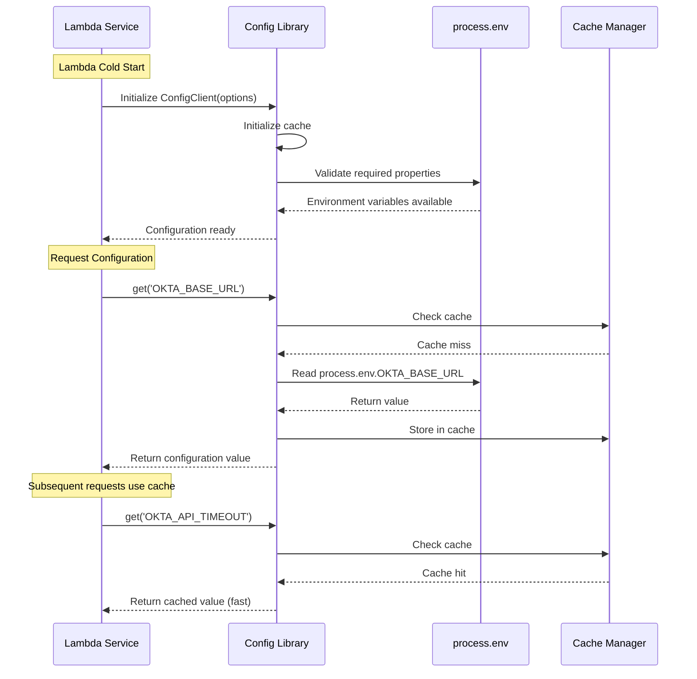
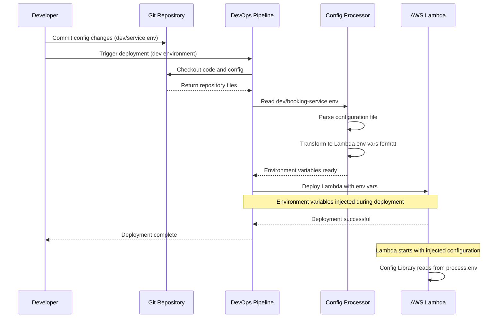
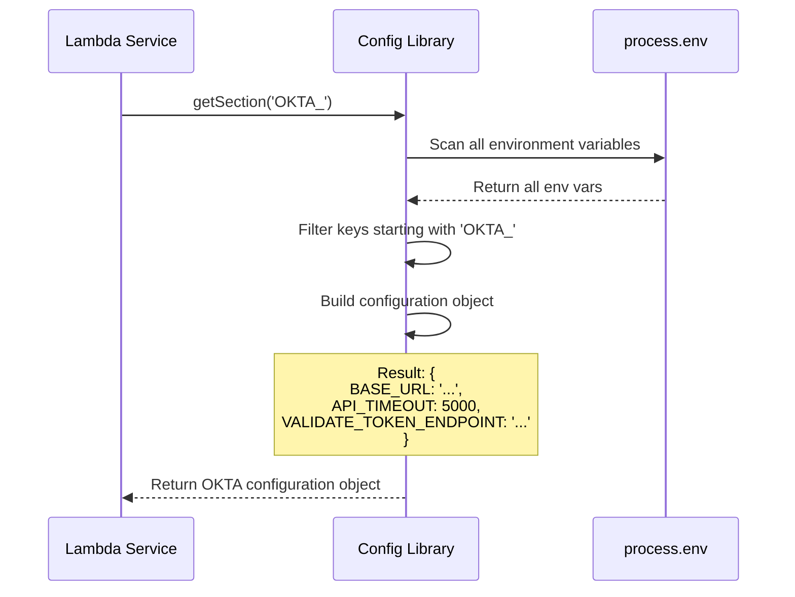

# Externalizing Environment Variables Library - Technical Design Document

## Table of Contents
1. [System Overview](#system-overview)
2. [Library Architecture](#library-architecture)
3. [Library Specification](#library-specification)
4. [Environment Variable Management](#environment-variable-management)
5. [Configuration Structure](#configuration-structure)
6. [Sequence Diagrams](#sequence-diagrams)
7. [Error Handling](#error-handling)
8. [Security](#security)
9. [Performance Optimization](#performance-optimization)
10. [Monitoring and Logging](#monitoring-and-logging)

## System Overview

This document outlines the design for the **Externalizing Environment Variables Library**, a centralized configuration management solution for the InsCore Policy Booking Application. This library provides a unified interface for all Lambda services to access environment-specific configuration that is injected by the DevOps CI/CD pipeline during deployment.

### Technology Stack Compatibility
- **Runtime**: Node.js 20.x.x (compatible with master TDD backend architecture)
- **Language**: TypeScript 5.4.x
- **Package Manager**: npm 10.x
- **AWS SDK**: v3.x (optimized for Node.js 20.x.x)
- **Testing Framework**: Jest (compatible with Node.js 20.x.x)
- **Configuration Source**: Lambda Environment Variables (injected by DevOps pipeline)

### Key Features
- **Centralized Configuration Access**: Single library interface for all environment variables
- **Environment-Specific Configs**: Support for dev, uat, prod environments
- **DevOps Pipeline Integration**: Configuration injected during deployment from Git repository
- **Configuration Caching**: In-memory caching for optimal performance
- **Fallback Mechanisms**: Graceful degradation with default values
- **Type-Safe Access**: TypeScript interfaces for configuration properties
- **Reusable Library**: Shared across all InsCore Lambda services
- **No External Dependencies**: Direct access to Lambda environment variables

### Configuration Management Approach

**DevOps Pipeline Workflow**:
1. Configuration files stored in Git repository (per environment)
2. DevOps CI/CD pipeline reads configuration files during deployment
3. Pipeline injects configuration as Lambda environment variables
4. Lambda services use Config Library to access environment variables
5. Configuration changes require redeployment through pipeline

**Benefits**:
- No runtime dependency on external configuration servers
- Faster configuration access (no network calls)
- Simplified architecture and reduced operational complexity
- Configuration versioned with application code in Git
- Auditable deployment history through CI/CD pipeline

## Library Architecture

### High-Level Architecture
```
┌─────────────────────────────────────────────────────────────────┐
│                    InsCore Lambda Services                      │
│  ┌──────────────┐  ┌──────────────┐  ┌──────────────┐         │
│  │   Booking    │  │ UI Component │  │  Validation  │   ...   │
│  │   Service    │  │   Service    │  │   Service    │         │
│  └──────┬───────┘  └──────┬───────┘  └──────┬───────┘         │
│         │                  │                  │                  │
│         └──────────────────┼──────────────────┘                 │
│                            │                                     │
│                   ┌────────▼────────┐                           │
│                   │  Config Library │                           │
│                   │  (Accessor)     │                           │
│                   └────────┬────────┘                           │
│                            │                                     │
│                   ┌────────▼─────────┐                          │
│                   │  Lambda Env Vars │                          │
│                   │  (process.env)   │                          │
│                   └────────┬─────────┘                          │
└────────────────────────────┼──────────────────────────────────┘
                             │
                    ┌────────▼─────────┐
                    │   Cache Manager  │
                    │  (In-Memory)     │
                    └──────────────────┘

DevOps Pipeline Deployment Flow:
┌─────────────┐     ┌──────────────┐     ┌─────────────────┐
│     Git     │────▶│   DevOps     │────▶│     Lambda      │
│ Repository  │     │   Pipeline   │     │  (with env vars)│
│ (Config)    │     │ (Inject Vars)│     │                 │
└─────────────┘     └──────────────┘     └─────────────────┘
```

### Core Components
- **Config Library**: Node.js library providing typed access to environment variables
- **Configuration Cache**: In-memory cache for parsed configuration objects
- **Environment Variable Accessor**: Direct access to process.env
- **Property Parser**: Parses dot-notation keys from environment variables
- **Default Value Handler**: Manages fallback values for missing properties
- **Type Converter**: Converts string environment variables to appropriate types

### Configuration Injection Process

**Git Repository Structure**:
```
inscore-config-repo/
├── dev/
│   ├── booking-management-service.env
│   ├── ui-components-service.env
│   └── validation-service.env
├── uat/
│   ├── booking-management-service.env
│   ├── ui-components-service.env
│   └── validation-service.env
└── prod/
    ├── booking-management-service.env
    ├── ui-components-service.env
    └── validation-service.env
```

**DevOps Pipeline Process**:
1. Pipeline triggered for environment (dev/uat/prod)
2. Pipeline reads `{environment}/{service-name}.env` file from Git
3. Pipeline transforms config file into Lambda environment variables
4. Lambda function deployed with environment variables injected
5. Config Library reads from process.env at runtime

## Library Specification

### Library Function Details

**Library Name**: `ConfigClient` or `Config`
**Type**: Lambda Library (shared across all services)
**Purpose**: Provide typed access to environment-specific configuration from Lambda environment variables

### Configuration Client Initialization

#### Initialization Parameters
```typescript
interface ConfigClientOptions {
  cacheEnabled?: boolean;            // Enable in-memory caching (default: true)
  validateOnInit?: boolean;          // Validate required properties on initialization (default: true)
  requiredProperties?: string[];     // List of required property keys
  strictMode?: boolean;              // Throw error if property not found (default: false)
  typeConversion?: boolean;          // Auto-convert string values to appropriate types (default: true)
}
```

#### Example Initialization
```typescript
import { ConfigClient } from '@inscore/config-library';

// Initialize during Lambda cold start
const configClient = new ConfigClient({
  cacheEnabled: true,
  validateOnInit: true,
  requiredProperties: [
    'OKTA_BASE_URL',
    'POSTGRESQL_HOST',
    'DYNAMODB_REGION'
  ],
  strictMode: false,
  typeConversion: true
});
```

### Library Methods

#### 1. get()
Retrieve a specific configuration property from environment variables.

**Method Signature**:
```typescript
get(key: string, defaultValue?: any): any
```

**Parameters**:
- `key`: Environment variable name (e.g., "OKTA_BASE_URL")
- `defaultValue`: Default value if property not found

**Returns**: Property value or default value

**Example Usage**:
```typescript
const oktaUrl = configClient.get('OKTA_BASE_URL');
const oktaTimeout = configClient.get('OKTA_API_TIMEOUT', 5000);
const dbHost = configClient.get('POSTGRESQL_HOST');
```

#### 2. getSection()
Retrieve all configuration properties with a specific prefix.

**Method Signature**:
```typescript
getSection(prefix: string): Record<string, any>
```

**Parameters**:
- `prefix`: Environment variable prefix (e.g., "OKTA_", "POSTGRESQL_")

**Returns**: Object with all matching properties

**Example Usage**:
```typescript
// Returns all environment variables starting with "OKTA_"
const oktaConfig = configClient.getSection('OKTA_');
// Result: { BASE_URL: '...', API_TIMEOUT: 5000, VALIDATE_TOKEN_ENDPOINT: '...' }

const dbConfig = configClient.getSection('POSTGRESQL_');
// Result: { HOST: '...', PORT: 5432, DATABASE: '...', USERNAME: '...' }
```

#### 3. getAll()
Get all configuration properties.

**Method Signature**:
```typescript
getAll(): Record<string, any>
```

**Returns**: Object containing all environment variables

**Example Usage**:
```typescript
const allConfig = configClient.getAll();
console.log(allConfig['OKTA_BASE_URL']);
console.log(allConfig['POSTGRESQL_HOST']);
```

#### 4. has()
Check if a configuration property exists.

**Method Signature**:
```typescript
has(key: string): boolean
```

**Parameters**:
- `key`: Environment variable name

**Returns**: Boolean indicating if property exists

**Example Usage**:
```typescript
if (configClient.has('FEATURE_FLAG_CACHING')) {
  const cachingEnabled = configClient.get('FEATURE_FLAG_CACHING');
}
```

#### 5. getTyped()
Retrieve a property with automatic type conversion.

**Method Signature**:
```typescript
getTyped<T>(key: string, defaultValue?: T): T
```

**Parameters**:
- `key`: Environment variable name
- `defaultValue`: Default value with type

**Returns**: Property value with correct type

**Example Usage**:
```typescript
const timeout = configClient.getTyped<number>('OKTA_API_TIMEOUT', 5000);
const enabled = configClient.getTyped<boolean>('FEATURE_FLAG_CACHING', true);
const hosts = configClient.getTyped<string[]>('ALLOWED_HOSTS', []);
```

## Environment Variable Management

### Environment Variable Naming Conventions

#### Naming Standards
- Use UPPERCASE with underscores for environment variables: `OKTA_BASE_URL`
- Use prefix grouping for related properties: `OKTA_*`, `POSTGRESQL_*`, `DYNAMODB_*`
- Use descriptive names: `POSTGRESQL_RDS_PROXY_ENDPOINT`
- Keep names concise but clear: `DB_HOST` vs `DATABASE_HOST_NAME`

#### Reserved Property Prefixes
- `AWS_*`: AWS service configurations
- `VAULT_*`: HashiCorp Vault configurations
- `OKTA_*`: Okta authentication configurations
- `ENTITLEMENTS_*`: Entitlements service configurations
- `POSTGRESQL_*`: PostgreSQL database configurations
- `DYNAMODB_*`: DynamoDB configurations
- `S3_*`: S3 configurations
- `LOG_*`: Logging configurations
- `MONITORING_*`: Monitoring configurations
- `FEATURE_FLAG_*`: Feature toggle configurations

### DevOps Pipeline Configuration Files

#### booking-management-service.env (Production)
```bash
# Okta Configuration
OKTA_BASE_URL=https://okta-sys-api-v1-prod.prod.ss.hip10.npuweks.us-east-1.aws.aig.net/api
OKTA_API_TIMEOUT=5000
OKTA_VALIDATE_TOKEN_ENDPOINT=/validate-token

# Vault Configuration
VAULT_ADDRESS=https://vault.inscore.internal:8200
VAULT_NAMESPACE=inscore
VAULT_AUTH_MOUNT_PATH=auth/aws
VAULT_ROLE=lambda-role

# Entitlements Configuration
ENTITLEMENTS_BASE_URL=https://entitlement-api-v1-prod.prod.ss.hip10.npuweks.us-east-1.aws.aig.net/api
ENTITLEMENTS_APP_ID=7454
ENTITLEMENTS_API_TIMEOUT=5000

# PostgreSQL Configuration
POSTGRESQL_HOST=inscore-prod-rds.cluster-xxxxx.us-east-1.rds.amazonaws.com
POSTGRESQL_PORT=5432
POSTGRESQL_DATABASE=inscore_db
POSTGRESQL_USERNAME=lambda_user
POSTGRESQL_USE_IAM_AUTH=true
POSTGRESQL_RDS_PROXY_ENDPOINT=inscore-rds-proxy.proxy-xyz.us-east-1.rds.amazonaws.com

# DynamoDB Configuration
DYNAMODB_REGION=us-east-1
DYNAMODB_FLOW_CONFIGURATIONS_TABLE=service-function-flows
DYNAMODB_UI_COMPONENT_CATALOG_TABLE=ui-component-catalog
DYNAMODB_BOOKING_COMPONENT_STATUS_TABLE=booking-component-status

# S3 Configuration
S3_REGION=us-east-1
S3_POM_BUCKET=inscore-pom-schemas-prod
S3_POLICY_DATA_BUCKET=inscore-policy-data-prod

# Logging Configuration
LOG_LEVEL=info
LOG_STRUCTURED=true
LOG_CORRELATION_ID_ENABLED=true

# Monitoring Configuration
MONITORING_CLOUDWATCH_NAMESPACE=Inscore/Booking/Prod
MONITORING_XRAY_TRACING_ENABLED=true
MONITORING_CUSTOM_METRICS_ENABLED=true

# Feature Flags
FEATURE_FLAG_CACHING=true
FEATURE_FLAG_ASYNC_VALIDATION=true
FEATURE_FLAG_BATCH_PROCESSING=true

# Common Configuration
COMMON_RETRY_ATTEMPTS=3
COMMON_RETRY_DELAY=1000
COMMON_TIMEOUT=30000
COMMON_MAX_CONNECTIONS=100
```

#### booking-management-service.env (Development)
```bash
# Okta Configuration
OKTA_BASE_URL=https://okta-sys-api-v1-dev.dev.ss.hip10.npuweks.us-east-1.aws.aig.net/api
OKTA_API_TIMEOUT=10000
OKTA_VALIDATE_TOKEN_ENDPOINT=/validate-token

# Vault Configuration
VAULT_ADDRESS=https://vault-dev.inscore.internal:8200
VAULT_NAMESPACE=inscore
VAULT_AUTH_MOUNT_PATH=auth/aws
VAULT_ROLE=lambda-role

# Entitlements Configuration
ENTITLEMENTS_BASE_URL=https://entitlement-api-v1-dev.dev.ss.hip10.npuweks.us-east-1.aws.aig.net/api
ENTITLEMENTS_APP_ID=7454
ENTITLEMENTS_API_TIMEOUT=10000

# PostgreSQL Configuration
POSTGRESQL_HOST=inscore-dev-rds.cluster-xxxxx.us-east-1.rds.amazonaws.com
POSTGRESQL_PORT=5432
POSTGRESQL_DATABASE=inscore_db_dev
POSTGRESQL_USERNAME=lambda_user
POSTGRESQL_USE_IAM_AUTH=true
POSTGRESQL_RDS_PROXY_ENDPOINT=inscore-dev-rds-proxy.proxy-xyz.us-east-1.rds.amazonaws.com

# DynamoDB Configuration
DYNAMODB_REGION=us-east-1
DYNAMODB_FLOW_CONFIGURATIONS_TABLE=service-function-flows-dev
DYNAMODB_UI_COMPONENT_CATALOG_TABLE=ui-component-catalog-dev
DYNAMODB_BOOKING_COMPONENT_STATUS_TABLE=booking-component-status-dev

# S3 Configuration
S3_REGION=us-east-1
S3_POM_BUCKET=inscore-pom-schemas-dev
S3_POLICY_DATA_BUCKET=inscore-policy-data-dev

# Logging Configuration
LOG_LEVEL=debug
LOG_STRUCTURED=true
LOG_CORRELATION_ID_ENABLED=true

# Monitoring Configuration
MONITORING_CLOUDWATCH_NAMESPACE=Inscore/Booking/Dev
MONITORING_XRAY_TRACING_ENABLED=true
MONITORING_CUSTOM_METRICS_ENABLED=true

# Feature Flags
FEATURE_FLAG_CACHING=false
FEATURE_FLAG_ASYNC_VALIDATION=true
FEATURE_FLAG_BATCH_PROCESSING=false

# Common Configuration
COMMON_RETRY_ATTEMPTS=3
COMMON_RETRY_DELAY=1000
COMMON_TIMEOUT=30000
COMMON_MAX_CONNECTIONS=100
```

### Type Conversion Rules

The library automatically converts string environment variables to appropriate types:

**Boolean Conversion**:
- `"true"` → `true`
- `"false"` → `false`
- `"1"` → `true`
- `"0"` → `false`

**Number Conversion**:
- `"5000"` → `5000`
- `"3.14"` → `3.14`

**Array Conversion**:
- `"value1,value2,value3"` → `["value1", "value2", "value3"]`
- `"host1:5432,host2:5432"` → `["host1:5432", "host2:5432"]`

**JSON Object Conversion**:
- `'{"key":"value"}'` → `{ key: "value" }`

## Configuration Structure

### Typed Configuration Interfaces

```typescript
// Configuration type definitions
interface OktaConfig {
  baseUrl: string;
  apiTimeout: number;
  validateTokenEndpoint: string;
}

interface PostgreSQLConfig {
  host: string;
  port: number;
  database: string;
  username: string;
  useIamAuth: boolean;
  rdsProxyEndpoint: string;
}

interface DynamoDBConfig {
  region: string;
  flowConfigurationsTable: string;
  uiComponentCatalogTable: string;
  bookingComponentStatusTable: string;
}

interface S3Config {
  region: string;
  pomBucket: string;
  policyDataBucket: string;
}

interface LoggingConfig {
  level: 'debug' | 'info' | 'warn' | 'error';
  structured: boolean;
  correlationIdEnabled: boolean;
}

interface ApplicationConfig {
  okta: OktaConfig;
  postgresql: PostgreSQLConfig;
  dynamodb: DynamoDBConfig;
  s3: S3Config;
  logging: LoggingConfig;
}
```

### Configuration Helper Methods

```typescript
class ConfigClient {
  // Get typed configuration section
  getOktaConfig(): OktaConfig {
    return {
      baseUrl: this.get('OKTA_BASE_URL'),
      apiTimeout: this.getTyped<number>('OKTA_API_TIMEOUT', 5000),
      validateTokenEndpoint: this.get('OKTA_VALIDATE_TOKEN_ENDPOINT', '/validate-token')
    };
  }

  getPostgreSQLConfig(): PostgreSQLConfig {
    return {
      host: this.get('POSTGRESQL_HOST'),
      port: this.getTyped<number>('POSTGRESQL_PORT', 5432),
      database: this.get('POSTGRESQL_DATABASE'),
      username: this.get('POSTGRESQL_USERNAME'),
      useIamAuth: this.getTyped<boolean>('POSTGRESQL_USE_IAM_AUTH', true),
      rdsProxyEndpoint: this.get('POSTGRESQL_RDS_PROXY_ENDPOINT')
    };
  }

  getDynamoDBConfig(): DynamoDBConfig {
    return {
      region: this.get('DYNAMODB_REGION', 'us-east-1'),
      flowConfigurationsTable: this.get('DYNAMODB_FLOW_CONFIGURATIONS_TABLE'),
      uiComponentCatalogTable: this.get('DYNAMODB_UI_COMPONENT_CATALOG_TABLE'),
      bookingComponentStatusTable: this.get('DYNAMODB_BOOKING_COMPONENT_STATUS_TABLE')
    };
  }
}
```

## Sequence Diagrams

### Configuration Access During Lambda Execution



### DevOps Pipeline Deployment Flow



### Configuration Section Retrieval



## Error Handling

### Error Types and Handling Strategy

#### Configuration Library Errors

- **PROPERTY_NOT_FOUND**: Requested environment variable does not exist
  - **Cause**: Environment variable not set, typo in property key
  - **Recovery**: Return default value if provided
  - **Fallback**: Throw error in strict mode, return null otherwise

- **INVALID_TYPE_CONVERSION**: Failed to convert string value to requested type
  - **Cause**: Invalid format for number/boolean/JSON conversion
  - **Recovery**: Log warning, return default value
  - **Fallback**: Return raw string value

- **REQUIRED_PROPERTY_MISSING**: Required property not found during initialization
  - **Cause**: Missing environment variable in Lambda configuration
  - **Recovery**: Fail Lambda initialization (fail-fast)
  - **Fallback**: None - deployment issue must be fixed

- **CACHE_INITIALIZATION_ERROR**: Failed to initialize cache manager
  - **Cause**: Memory constraints
  - **Recovery**: Disable caching, access env vars directly
  - **Fallback**: Continue without cache (performance impact)

### Error Response Structure

```typescript
interface ConfigError {
  code: string;
  message: string;
  details: {
    propertyKey: string;
    expectedType?: string;
    actualValue?: string;
    timestamp: string;
  };
  recoveryAction: string;
}
```

### Validation Rules

- Required properties must be set during Lambda deployment
- Property keys must be non-empty strings
- Type conversion must produce valid result or use default
- Boolean values must be: true, false, 1, 0, yes, no
- Number values must be valid numeric strings
- JSON values must be valid JSON syntax

### Example Error Handling

```typescript
// Example 1: Property with default value
const timeout = configClient.get('OKTA_API_TIMEOUT', 5000);

// Example 2: Strict mode - throws error if not found
const configClient = new ConfigClient({ strictMode: true });
try {
  const url = configClient.get('OKTA_BASE_URL'); // Throws if not found
} catch (error) {
  console.error('Missing required configuration:', error.message);
}

// Example 3: Type-safe access with error handling
try {
  const timeout = configClient.getTyped<number>('OKTA_API_TIMEOUT', 5000);
} catch (error) {
  console.error('Invalid timeout configuration:', error.message);
  // Use default
  const timeout = 5000;
}

// Example 4: Check before access
if (configClient.has('FEATURE_FLAG_CACHING')) {
  const enabled = configClient.getTyped<boolean>('FEATURE_FLAG_CACHING');
}
```

## Security

### Environment Variable Security

#### Secure Configuration Management

- **Git Repository Security**: Configuration files stored in private Git repository with access control
- **Pipeline Security**: DevOps pipeline uses secure credentials for Git access
- **Deployment Isolation**: Each environment (dev/uat/prod) has separate configuration files
- **Audit Trail**: All configuration changes tracked in Git history
- **Approval Process**: Production configuration changes require approval

#### Sensitive Data Handling

**Vault Integration for Secrets**:
- Sensitive values (passwords, API keys) stored in HashiCorp Vault
- Config file contains Vault paths, not actual secrets
- Lambda fetches secrets from Vault at runtime using Vault Lambda Extension
- Secrets never committed to Git or visible in environment variables

**Example Configuration with Vault Integration**:
```bash
# booking-management-service.env (Production)
POSTGRESQL_HOST=inscore-prod-rds.cluster-xxxxx.us-east-1.rds.amazonaws.com
POSTGRESQL_PORT=5432
POSTGRESQL_DATABASE=inscore_db
POSTGRESQL_USERNAME=lambda_user

# Vault paths for sensitive data (fetched by Vault Lambda Extension)
VAULT_SECRET_PATH=/inscore/prod/rds/credentials
VAULT_SECRET_PATH_API_KEYS=/inscore/prod/api/keys
```

#### Lambda Environment Variable Security

- **Encryption at Rest**: Lambda environment variables encrypted using AWS KMS
- **Encryption in Transit**: All communication over TLS 1.2 or higher
- **IAM Permissions**: Lambda execution role has minimal required permissions
- **No Sensitive Data in Logs**: Library filters sensitive properties from logs
- **Environment Variable Limits**: AWS Lambda limit: 4KB total for all environment variables

### Security Best Practices

- **Principle of Least Privilege**: Lambda IAM roles have minimal permissions
- **Secret Rotation**: Sensitive credentials rotated regularly through Vault
- **Access Control**: Git repository access restricted to authorized personnel
- **Configuration Validation**: Pipeline validates configuration before deployment
- **Immutable Deployments**: Configuration changes require redeployment
- **Audit Logging**: All configuration access logged for security audits
- **No Hardcoding**: No configuration hardcoded in application code

## Performance Optimization

### Caching Strategy

#### In-Memory Cache Implementation
```typescript
class ConfigCache {
  private cache: Map<string, CacheEntry>;

  constructor() {
    this.cache = new Map();
  }

  set(key: string, value: any): void {
    this.cache.set(key, {
      value,
      timestamp: Date.now()
    });
  }

  get(key: string): any | null {
    const entry = this.cache.get(key);
    return entry ? entry.value : null;
  }

  has(key: string): boolean {
    return this.cache.has(key);
  }

  clear(): void {
    this.cache.clear();
  }
}
```

#### Cache Strategy
- **Cold Start**: Cache initialized empty, populated on first access
- **Warm Start**: Cache persists across invocations (Lambda container reuse)
- **Cache Key**: Direct environment variable name (e.g., "OKTA_BASE_URL")
- **Cache Invalidation**: Cache cleared only on Lambda container restart
- **Memory Efficiency**: Minimal memory footprint (only accessed properties cached)

### Optimization Strategies

- **Lazy Loading**: Properties loaded only when accessed
- **Eager Loading**: Optional pre-loading of critical properties during initialization
- **Type Conversion Caching**: Converted values cached to avoid repeated parsing
- **Section Caching**: Entire sections (e.g., all OKTA_* properties) cached together
- **No Network Calls**: Zero network latency (direct process.env access)

### Response Time Goals

- **Cold Start - First Access**: < 1ms to read from process.env
- **Warm Start - Cached Access**: < 0.1ms to read from in-memory cache
- **Section Retrieval**: < 2ms to scan and filter all environment variables
- **Type Conversion**: < 0.5ms for number/boolean conversion
- **Initialization**: < 5ms including validation and cache setup

**Performance Comparison**:
- **Environment Variable Access**: < 1ms (no network)
- **Spring Cloud Config**: 50-100ms (network call - NOT USED)
- **Parameter Store**: 20-50ms (AWS API call)
- **Secrets Manager**: 30-80ms (AWS API call)

## Monitoring and Logging

### CloudWatch Integration

#### Structured Logging
```typescript
interface ConfigLogEntry {
  timestamp: string;
  level: 'INFO' | 'WARN' | 'ERROR';
  operation: 'INIT' | 'GET' | 'GET_SECTION' | 'CACHE_HIT' | 'CACHE_MISS';
  propertyKey: string;
  cacheHit: boolean;
  duration: number;
  correlationId: string;
}
```

#### Log Examples
```json
{
  "timestamp": "2024-11-14T10:30:00.123Z",
  "level": "INFO",
  "operation": "GET",
  "propertyKey": "OKTA_BASE_URL",
  "cacheHit": true,
  "duration": 0.05,
  "correlationId": "abc-123-def-456"
}
```

### Custom Metrics

#### Configuration Access Metrics
- **ConfigPropertyAccess**: Number of property access requests
- **ConfigCacheHitRate**: Percentage of requests served from cache
- **ConfigCacheMissRate**: Percentage of requests requiring env var access
- **ConfigPropertyNotFound**: Count of missing property attempts
- **ConfigTypeConversionErrors**: Count of type conversion failures
- **ConfigInitializationDuration**: Time to initialize Config Library

#### Operational Metrics
- **RequiredPropertyMissing**: Count of missing required properties on init
- **ConfigValidationErrors**: Count of validation failures
- **ConfigSectionAccess**: Count of section retrieval operations
- **ConfigLibraryErrors**: Count of library errors by error type

### Alerting and Notifications

#### Critical Alerts
- **Missing Required Property**: Alert when required property not found during init
- **High Error Rate**: Alert when error rate exceeds 5% over 10-minute window
- **Type Conversion Failures**: Alert when conversion errors exceed threshold
- **Cache Initialization Failure**: Alert on cache initialization errors

### Usage Examples

#### Example 1: Basic Configuration Access
```typescript
import { ConfigClient } from '@inscore/config-library';

// Initialize during Lambda cold start
const config = new ConfigClient({
  cacheEnabled: true,
  requiredProperties: ['OKTA_BASE_URL', 'POSTGRESQL_HOST']
});

// Access configuration properties
exports.handler = async (event) => {
  const oktaUrl = config.get('OKTA_BASE_URL');
  const dbHost = config.get('POSTGRESQL_HOST');
  const timeout = config.getTyped<number>('OKTA_API_TIMEOUT', 5000);

  // Business logic...
};
```

#### Example 2: Typed Configuration Sections
```typescript
import { ConfigClient } from '@inscore/config-library';

class BookingManagementService {
  private config: ConfigClient;

  constructor() {
    this.config = new ConfigClient({ cacheEnabled: true });
  }

  async handler(event: any) {
    // Get typed Okta configuration
    const oktaConfig = this.config.getOktaConfig();
    console.log(`Okta URL: ${oktaConfig.baseUrl}`);
    console.log(`Timeout: ${oktaConfig.apiTimeout}ms`);

    // Get typed database configuration
    const dbConfig = this.config.getPostgreSQLConfig();
    console.log(`DB Host: ${dbConfig.host}:${dbConfig.port}`);

    // Business logic using typed configuration
    // ...
  }
}
```

#### Example 3: Section-Based Configuration Access
```typescript
import { ConfigClient } from '@inscore/config-library';

const config = new ConfigClient();

// Get all Okta-related configuration
const oktaConfig = config.getSection('OKTA_');
console.log(oktaConfig);
// Output: {
//   BASE_URL: 'https://...',
//   API_TIMEOUT: 5000,
//   VALIDATE_TOKEN_ENDPOINT: '/validate-token'
// }

// Get all DynamoDB table names
const dynamoConfig = config.getSection('DYNAMODB_');
console.log(dynamoConfig);
// Output: {
//   REGION: 'us-east-1',
//   FLOW_CONFIGURATIONS_TABLE: 'service-function-flows',
//   UI_COMPONENT_CATALOG_TABLE: 'ui-component-catalog',
//   ...
// }
```

#### Example 4: Feature Flags
```typescript
import { ConfigClient } from '@inscore/config-library';

const config = new ConfigClient();

// Check feature flags
const cachingEnabled = config.getTyped<boolean>('FEATURE_FLAG_CACHING', false);
const asyncValidation = config.getTyped<boolean>('FEATURE_FLAG_ASYNC_VALIDATION', false);

if (cachingEnabled) {
  // Enable caching logic
}

if (asyncValidation) {
  // Enable async validation
}
```

## Integration with Existing Libraries

### Flow Engine Library Integration
```typescript
// flow-engine.ts
import { ConfigClient } from '@inscore/config-library';

const config = new ConfigClient();

const flowTableName = config.get('DYNAMODB_FLOW_CONFIGURATIONS_TABLE');
const defaultTimeout = config.getTyped<number>('FLOW_ENGINE_DEFAULT_TIMEOUT', 30000);
```

### Validate Token Library Integration
```typescript
// validate-token-library.ts
import { ConfigClient } from '@inscore/config-library';

const config = new ConfigClient();

const oktaConfig = {
  baseUrl: config.get('OKTA_BASE_URL'),
  timeout: config.getTyped<number>('OKTA_API_TIMEOUT', 5000),
  endpoint: config.get('OKTA_VALIDATE_TOKEN_ENDPOINT', '/validate-token')
};
```

### Entitlements Library Integration
```typescript
// entitlements-library.ts
import { ConfigClient } from '@inscore/config-library';

const config = new ConfigClient();

const entitlementsConfig = {
  baseUrl: config.get('ENTITLEMENTS_BASE_URL'),
  appId: config.get('ENTITLEMENTS_APP_ID'),
  timeout: config.getTyped<number>('ENTITLEMENTS_API_TIMEOUT', 5000)
};
```

### Vault Lambda Extension Integration
```typescript
// vault-lambda-extension.ts
import { ConfigClient } from '@inscore/config-library';

const config = new ConfigClient();

const vaultConfig = {
  address: config.get('VAULT_ADDRESS'),
  namespace: config.get('VAULT_NAMESPACE'),
  role: config.get('VAULT_ROLE'),
  authMountPath: config.get('VAULT_AUTH_MOUNT_PATH')
};
```

## DevOps Pipeline Integration

### Pipeline Configuration Example

```yaml
# .gitlab-ci.yml or equivalent
stages:
  - build
  - deploy

deploy-dev:
  stage: deploy
  script:
    - export ENVIRONMENT=dev
    - export SERVICE_NAME=booking-management-service

    # Read configuration from Git
    - export CONFIG_FILE="config/${ENVIRONMENT}/${SERVICE_NAME}.env"

    # Deploy Lambda with environment variables
    - aws lambda update-function-configuration \
        --function-name "${SERVICE_NAME}-${ENVIRONMENT}" \
        --environment "Variables=$(cat $CONFIG_FILE | jq -Rs 'split(\"\n\") | map(select(length > 0 and startswith(\"#\") | not) | split(\"=\")) | map({key: .[0], value: .[1]}) | from_entries')"
  only:
    - dev

deploy-prod:
  stage: deploy
  script:
    - export ENVIRONMENT=prod
    - export SERVICE_NAME=booking-management-service

    # Read configuration from Git
    - export CONFIG_FILE="config/${ENVIRONMENT}/${SERVICE_NAME}.env"

    # Deploy Lambda with environment variables
    - aws lambda update-function-configuration \
        --function-name "${SERVICE_NAME}-${ENVIRONMENT}" \
        --environment "Variables=$(cat $CONFIG_FILE | jq -Rs 'split(\"\n\") | map(select(length > 0 and startswith(\"#\") | not) | split(\"=\")) | map({key: .[0], value: .[1]}) | from_entries')"
  only:
    - main
  when: manual
```

This design provides a simplified, performant, and secure foundation for centralized configuration management across all InsCore Lambda services by leveraging Lambda environment variables injected through the DevOps CI/CD pipeline, eliminating the complexity of external configuration servers.
