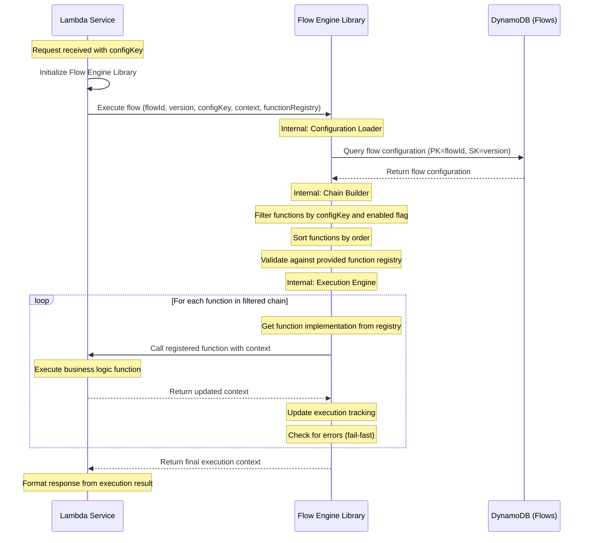
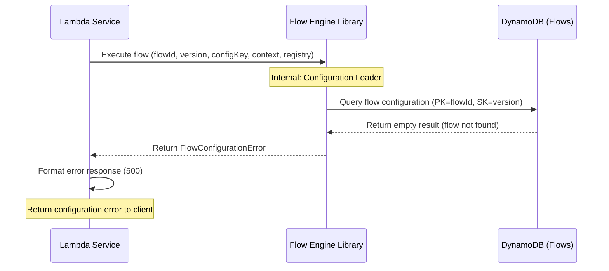
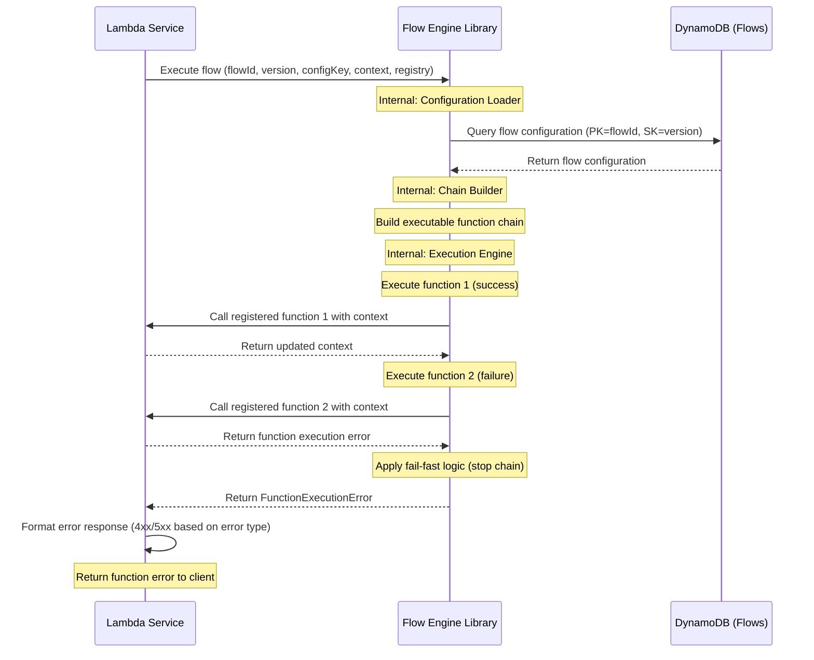
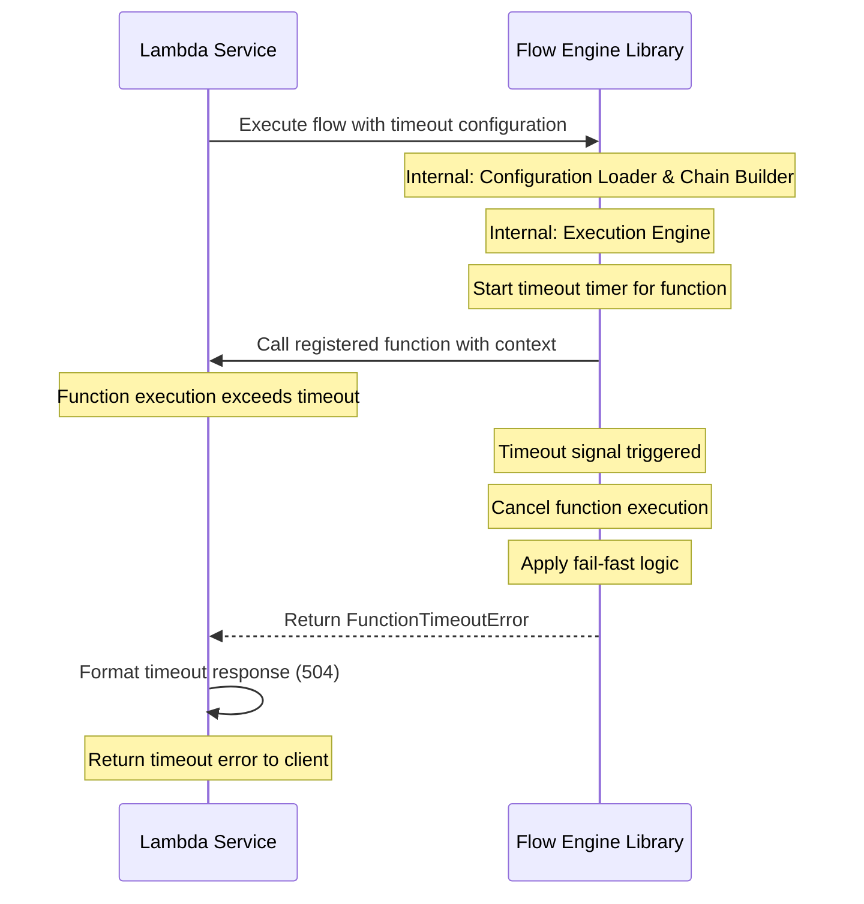

# Flow Engine Library Specification

## Table of Contents
1. [System Overview](#system-overview)
2. [Library Architecture](#library-architecture)
3. [Flow Execution Specification](#flow-execution-specification)
4. [Integration Specifications](#integration-specifications)
5. [Sequence Diagrams](#sequence-diagrams)
6. [Error Handling](#error-handling)
7. [Performance Optimization](#performance-optimization)
8. [Monitoring and Logging](#monitoring-and-logging)

## System Overview

The Flow Engine is a reusable Lambda library that provides configurable, sequential function execution capabilities. It enables Lambda services to execute business logic through dynamically configured function flows stored in DynamoDB, promoting code reusability and configuration-driven execution patterns across multiple services.

### Technology Stack Compatibility
- **Runtime**: Node.js 20.x.x (compatible with master TDD backend architecture)
- **Language**: TypeScript 5.4.x
- **Package Manager**: npm 10.x
- **AWS SDK**: v3.x (optimized for Node.js 20.x.x)
- **Testing Framework**: Jest (compatible with Node.js 20.x.x)
- **Build Tools**: TypeScript compiler, ESLint, Prettier

### Key Features
- **Dynamic Flow Configuration**: Function flows defined in DynamoDB and retrieved at runtime
- **Context-Driven Execution**: Shared context object passed through function chain
- **Conditional Execution**: Functions filtered based on config keys and skip conditions
- **Reusable Library**: Can be imported and used by multiple Lambda services
- **Error Handling**: Comprehensive error handling with fail-fast execution
- **Performance Optimized**: Flow configuration caching and connection pooling
- **Service Agnostic**: Generic execution engine adaptable to any business domain

## Library Architecture

### High-Level Architecture
```
┌─────────────────┐    ┌─────────────────┐    ┌─────────────────┐
│   Lambda A      │    │   Lambda B      │    │   Lambda C      │
│ (Booking Svc)   │    │ (Payment Svc)   │    │ (Notify Svc)    │
│                 │    │                 │    │                 │
│ ┌─────────────┐ │    │ ┌─────────────┐ │    │ ┌─────────────┐ │
│ │Flow Engine  │ │    │ │Flow Engine  │ │    │ │Flow Engine  │ │
│ │Library      │ │    │ │Library      │ │    │ │Library      │ │
│ └─────────────┘ │    │ └─────────────┘ │    │ └─────────────┘ │
└─────────────────┘    └─────────────────┘    └─────────────────┘
         │                       │                       │
         └───────────────────────┼───────────────────────┘
                                 │
                    ┌─────────────────────────────┐
                    │        DynamoDB             │
                    │   (Flow Configuration)      │
                    │ service-function-flows      │
                    └─────────────────────────────┘
```

### Core Components
- **Flow Configuration Loader**: Retrieves flow definitions from DynamoDB
- **Function Chain Builder**: Constructs executable function chains based on config keys
- **Context Manager**: Manages context object lifecycle and data flow
- **Execution Engine**: Orchestrates sequential function execution
- **Error Handler**: Manages function-level and flow-level error scenarios
- **Cache Manager**: Optimizes performance through configuration caching

### Integration Model
- **Library Import**: NPM package imported into Lambda functions
- **Service Registration**: Each service registers its function implementations
- **Flow Execution**: Engine executes service-specific flows with shared patterns
- **Configuration Sharing**: Common flow patterns reused across services
- **Context Evolution**: Standardized context object structure across all services

## Flow Execution Specification

### Execution Phases

#### Phase 1: Flow Configuration Retrieval
- **Purpose**: Load flow definition from DynamoDB
- **Input**: `flowId`, `version`, `configKey`
- **Process**: Query DynamoDB `service-function-flows` table
- **Output**: Flow configuration with function definitions
- **Caching**: Apply configuration caching if enabled
- **Validation**: Validate flow configuration structure and completeness

#### Phase 2: Function Chain Building
- **Purpose**: Build executable function sequence
- **Input**: Flow configuration, configKey, function registry
- **Process**: Apply function filtering logic
  - Filter by `enabled` flag (must be true)
  - Include functions where `configKeys` contains the specified configKey
  - Exclude functions where `skipConfigKeys` contains the specified configKey
  - Sort by `order` field (ascending)
- **Output**: Sequential list of executable functions
- **Validation**: Ensure all functions exist in function registry

#### Phase 3: Context Initialization
- **Purpose**: Initialize shared execution context
- **Input**: Request data, metadata, configuration
- **Process**: Create context object with standard structure
- **Output**: Initial context object
- **Metadata**: Add execution tracking, correlation IDs, timestamps

#### Phase 4: Sequential Function Execution
- **Purpose**: Execute functions in defined order
- **Input**: Function chain, initial context
- **Process**:
  - Execute each function with current context
  - Apply function-level timeouts
  - Handle retry policies if configured
  - Propagate context through chain
  - Stop execution on any failure (fail-fast)
- **Output**: Final context with accumulated results
- **Error Handling**: Comprehensive error capture and propagation

#### Phase 5: Result Processing
- **Purpose**: Process final execution results
- **Input**: Final context, execution metadata
- **Process**: Extract results, generate summary, cleanup resources
- **Output**: Structured execution result
- **Cleanup**: Release resources, clear temporary data

### Function Selection Logic

#### Filtering Criteria
1. **Enabled Check**: Function `enabled` must be `true`
2. **Config Key Inclusion**: Function `configKeys` must contain the specified configKey
3. **Skip Key Exclusion**: Function `skipConfigKeys` must NOT contain the specified configKey
4. **Order Sorting**: Functions sorted by `order` field in ascending sequence

#### Selection Examples
- **Flow**: "booking-initiate" with configKey "default"
- **Function A**: `enabled: true, configKeys: ["default", "premium"], skipConfigKeys: []` → **INCLUDED**
- **Function B**: `enabled: true, configKeys: ["premium"], skipConfigKeys: []` → **EXCLUDED** (configKey mismatch)
- **Function C**: `enabled: true, configKeys: ["default", "premium"], skipConfigKeys: ["express"]` → **INCLUDED**
- **Function D**: `enabled: false, configKeys: ["default"], skipConfigKeys: []` → **EXCLUDED** (disabled)

## Integration Specifications

### Library Initialization Requirements

#### Configuration Parameters
- **flowTableName**: DynamoDB table name for function flows
- **region**: AWS region for DynamoDB access
- **cacheEnabled**: Enable/disable flow configuration caching
- **cacheTimeout**: Cache timeout duration in milliseconds
- **defaultTimeout**: Default function execution timeout
- **retryEnabled**: Enable/disable retry policies
- **maxConcurrentFlows**: Maximum concurrent flow executions

#### Service Registration Requirements
- **Function Registry**: Map of function names to implementations
- **Context Schema**: Expected context object structure
- **Error Mapping**: Service-specific error code mappings
- **Timeout Configurations**: Service-level timeout overrides

### Common Library Functions Integration

The Flow Engine commonly integrates with InsCore's reusable library functions in the following execution sequence:

#### 1. Validate Token (`validateToken`)
- **Purpose**: Validate JWT tokens and extract user information via Okta API
- **Input**: `{ token: "string" }`
- **Output**: `{ isValid: boolean, payload: {...} }` with Gateway-Signature
- **Usage**: Typically first function in authentication flows

#### 2. Get Secrets (`getSecret`)
- **Purpose**: Retrieve secrets from HashiCorp Vault using AWS IAM authentication
- **Input**: `secretPath` (e.g., "inscore/prod/rds/db-credentials")
- **Output**: Secret data object from Vault
- **Usage**: Retrieve Authorization headers and credentials for external API calls

#### 3. Check User Role (`CheckUserRole`)
- **Purpose**: Validate user roles using bearer token
- **Input**: `{ bearerToken: "string", gatewaySignature: "string" }`
- **Output**: `{ isAuthorized: boolean, payload: {...} }` with user role information
- **Usage**: Authorization check for role-based access control

#### 4. Check User Permissions (`CheckUserPermissions`)
- **Purpose**: Validate user permissions for specific actions
- **Input**: `{ bearerToken: "string", gatewaySignature: "string", actions: ["string"] }`
- **Output**: `{ isAuthorized: boolean }` based on permission validation
- **Usage**: Fine-grained permission checks for specific operations

These functions are registered in the function registry and executed sequentially based on flow configuration.

### Lambda Service Integration Pattern

#### Integration Steps
1. **Library Import**: Import Flow Engine library into Lambda function
2. **Engine Initialization**: Initialize with service-specific configuration
3. **Function Registration**: Register service business functions (including common library functions)
4. **Request Processing**: Extract request data and prepare context
5. **Flow Execution**: Execute configured flow with context
6. **Response Formatting**: Format final response from execution results
7. **Error Handling**: Handle execution errors and return appropriate responses

#### Context Object Requirements

##### Initial Context Structure
```
{
  "requestId": "uuid-v4-string",
  "timestamp": "ISO-8601-datetime",
  "configKey": "configuration-key",
  "flowId": "flow-identifier",
  "version": "flow-version",
  "headers": {request-headers-object},
  "body": {request-body-object},
  "executedFunctions": [],
  "currentFunction": null
}
```

##### Context Evolution Through Execution
- **Function Results**: Each function adds its results to context
- **Execution Tracking**: Track executed functions and current function
- **Error State**: Maintain error information if failures occur
- **Metadata**: Preserve execution metadata throughout chain

## Sequence Diagrams

### Successful Flow Execution



### Flow Configuration Not Found



### Function Execution Failure



### Flow Execution Timeout



## Error Handling

### Error Types and Classifications

#### Flow Engine Errors
- **FlowConfigurationError**: Flow definition not found or invalid structure
  - **HTTP Status**: 500
  - **Cause**: Missing flow in DynamoDB, invalid flow schema
  - **Recovery**: Check flow configuration, validate DynamoDB data

- **FunctionRegistryError**: Required function not found in registry
  - **HTTP Status**: 500
  - **Cause**: Function name mismatch, missing function implementation
  - **Recovery**: Verify function registry completeness

- **FunctionExecutionError**: Individual function failure during execution
  - **HTTP Status**: Variable (based on function error type)
  - **Cause**: Business logic errors, validation failures, external service failures
  - **Recovery**: Function-specific error handling

- **FunctionTimeoutError**: Function execution exceeded configured timeout
  - **HTTP Status**: 504
  - **Cause**: Long-running operations, external service delays
  - **Recovery**: Increase timeout, optimize function performance

- **ContextValidationError**: Invalid context object structure or data
  - **HTTP Status**: 400
  - **Cause**: Malformed context, missing required fields
  - **Recovery**: Validate context initialization

### Error Handling Strategy

#### Fail-Fast Execution
- **Principle**: Stop entire chain execution on first function failure
- **Context Preservation**: Maintain execution state for debugging
- **Error Propagation**: Bubble up specific error types with context
- **Cleanup**: Ensure resource cleanup on early termination

#### Error Context Information
- **Function Name**: Which function failed in the chain
- **Execution Order**: Position of failed function in sequence
- **Context State**: Context object state at time of failure
- **Error Details**: Specific error message and code
- **Execution Metadata**: Timing, correlation IDs, retry attempts

#### Retry Policy Integration
- **Function-Level Retries**: Apply retry policies from flow configuration
- **Retry Types**: Exponential, linear, fixed backoff strategies
- **Max Attempts**: Configurable maximum retry attempts
- **Timeout Respect**: Retries must respect overall timeout limits

## Performance Optimization

### Configuration Caching Strategy

#### Cache Implementation
- **In-Memory Caching**: Store frequently accessed flow configurations
- **TTL-Based Expiration**: Configurable time-to-live for cached entries
- **Cache Key Strategy**: Composite key using flowId, version, and configKey
- **Cache Invalidation**: Automatic invalidation on configuration updates
- **Memory Management**: LRU eviction for memory-constrained environments

#### Cache Performance Metrics
- **Cache Hit Rate**: Percentage of requests served from cache
- **Cache Miss Latency**: Time to retrieve from DynamoDB on cache miss
- **Memory Usage**: Cache memory consumption monitoring
- **Eviction Rate**: Frequency of cache entry evictions

### DynamoDB Optimization

#### Connection Management
- **Connection Pooling**: Reuse DynamoDB client connections
- **Connection Lifecycle**: Proper connection initialization and cleanup
- **Concurrent Requests**: Efficient handling of parallel flow executions
- **Region Optimization**: Use appropriate AWS region for minimal latency

#### Query Optimization
- **Primary Key Access**: Direct access using flowId and version
- **Projection Expressions**: Fetch only required attributes
- **Consistent Reads**: Use eventually consistent reads where appropriate
- **Batch Operations**: Batch requests when loading multiple flows

### Execution Performance

#### Function Chain Optimization
- **Pre-filtered Chains**: Build optimized execution chains upfront
- **Context Size Management**: Monitor and optimize context object size
- **Memory Allocation**: Efficient memory usage during execution
- **Parallel Preparation**: Pre-load configurations and validate registries

#### Timeout Management
- **Hierarchical Timeouts**: Function-level and flow-level timeout boundaries
- **Early Warning**: Alert on functions approaching timeout limits
- **Timeout Optimization**: Analyze and optimize slow-performing functions
- **Graceful Degradation**: Handle timeout scenarios gracefully

## Monitoring and Logging

### CloudWatch Integration

#### Structured Logging
- **Log Format**: Structured JSON logging with consistent schema
- **Correlation IDs**: Request correlation across function executions
- **Execution Context**: Log context evolution through function chain
- **Performance Metrics**: Execution timing for each function and overall flow
- **Error Details**: Comprehensive error information with stack traces

#### Custom Metrics

##### Flow Execution Metrics
- **FlowExecutions**: Total number of flow executions by service and flowId
- **FlowExecutionTime**: Average and percentile execution times
- **FlowSuccessRate**: Success rate percentage by flow and configKey
- **FlowFailureRate**: Failure rate breakdown by error type

##### Function Performance Metrics
- **FunctionExecutionTime**: Individual function execution times
- **FunctionRetryCount**: Number of retries per function
- **FunctionTimeoutRate**: Timeout rate per function
- **FunctionSuccessRate**: Success rate per function across all flows

##### Configuration Metrics
- **ConfigurationCacheHits**: Cache hit rate for flow configurations
- **ConfigurationLoadTime**: Time to load configurations from DynamoDB
- **ConfigurationErrors**: Rate of configuration-related errors
- **ContextObjectSize**: Average and maximum context object sizes

### Alerting and Notifications

#### Critical Alerts
- **Flow Configuration Missing**: Alert when flow configurations are not found
- **High Function Failure Rate**: Alert when function failure rates exceed thresholds
- **Execution Timeout Spike**: Alert on unusual timeout rate increases
- **Cache Performance Degradation**: Alert on significant cache hit rate drops
- **DynamoDB Access Errors**: Alert on database connectivity issues

#### Performance Monitoring
- **Execution Time Trends**: Monitor execution time trends and anomalies
- **Memory Usage Patterns**: Track memory consumption patterns
- **Error Rate Monitoring**: Continuous monitoring of error rates by type
- **Capacity Planning**: Alerts for scaling and capacity planning needs

### Operational Dashboards

#### Real-Time Dashboards
- **Flow Execution Overview**: Real-time flow execution statistics
- **Error Distribution**: Breakdown of errors by type and frequency
- **Performance Trends**: Execution time and throughput trends
- **System Health**: Overall system health indicators

#### Analytical Dashboards
- **Usage Patterns**: Flow usage patterns across services
- **Performance Analysis**: Detailed performance analysis by function
- **Capacity Utilization**: Resource utilization and capacity metrics
- **Cost Analysis**: Execution cost analysis and optimization opportunities

This Flow Engine Library specification provides a comprehensive foundation for reusable, configurable function execution across multiple Lambda services, with proper integration patterns, error handling, performance optimization, and monitoring capabilities. The specification maintains separation of concerns with the DynamoDB configuration detailed in the dedicated [DynamoDB Specification](./dynamodb-specification.md) document.