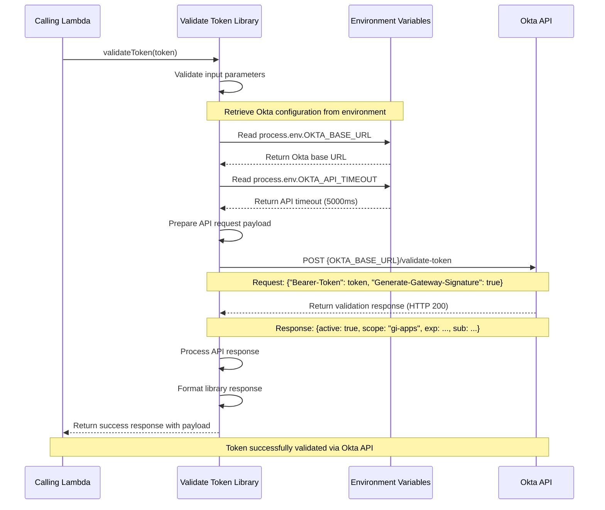
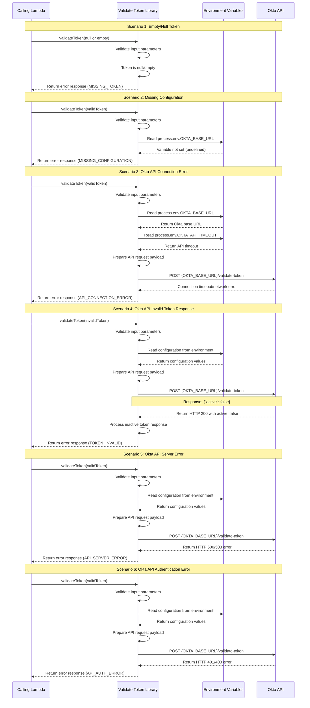

# Validate Token Library Function Design

## Table of Contents
1. [System Overview](#system-overview)
2. [Function Architecture](#function-architecture)
3. [Function Specification](#function-specification)
4. [Sequence Diagrams](#sequence-diagrams)
5. [Error Handling](#error-handling)
6. [Security](#security)
7. [Performance Optimization](#performance-optimization)
8. [Monitoring and Logging](#monitoring-and-logging)

## System Overview

This document outlines the design for the Validate Token library function, a common reusable Lambda function that validates JWT tokens and extracts user information for use across multiple services in the system.

### Technology Stack Compatibility
- **Runtime**: Node.js 20.x.x (compatible with master TDD backend architecture)
- **Language**: TypeScript 5.4.x
- **Package Manager**: npm 10.x
- **AWS SDK**: v3.x (optimized for Node.js 20.x.x)
- **HTTP Client**: Axios or AWS SDK HTTP client
- **Testing Framework**: Jest (compatible with Node.js 20.x.x)
- **JWT Libraries**: jsonwebtoken, jwt-decode (Node.js 20.x.x compatible)
- **Crypto Libraries**: Node.js 20.x.x native crypto module

### Key Features
- JWT token validation and verification
- User information extraction from token payload
- Token expiration checking
- Signature verification
- Reusable across multiple Lambda services
- Standardized error responses
- Security best practices implementation
- Configuration via Lambda environment variables

### Dependencies
- **Config Library** (Optional): Simple wrapper for accessing environment variables
- **Axios**: HTTP client for making requests to Okta API
- **Node.js 20.x.x**: Runtime environment
- **TypeScript 5.4.x**: Language and type definitions

## Function Architecture

### High-Level Architecture
```
Calling Lambda -> Validate Token Library -> Environment Variables (process.env)
                                        |
                                        └-> External Okta API -> Token Validation Response
```

### Core Components
- **Environment Variable Access**: Direct access to Lambda environment variables for Okta configuration
- **External API Integration**: Okta token validation service integration
- **Token Payload Processing**: Response handling and user information extraction
- **Error Handling**: API error handling with standardized error responses
- **Logging**: Security audit trail and API call monitoring

## Function Specification

### Library Function Details

**Function Name**: `validateToken`
**Type**: Lambda Library Function (shared across services)
**Purpose**: Validate JWT tokens via external Okta API and extract user information

### Configuration Management

**Configuration Source**: Lambda Environment Variables (injected by DevOps pipeline)

**Configuration Properties**:
```bash
# Okta Configuration (Environment Variables)
OKTA_BASE_URL=https://okta-sys-api-v1-{env}.{env}.ss.hip10.npuweks.us-east-1.aws.aig.net/api
OKTA_VALIDATE_TOKEN_ENDPOINT=/validate-token
OKTA_API_TIMEOUT=5000
```

**Environment-Specific Configuration Examples**:

**Dev Environment**:
```bash
OKTA_BASE_URL=https://okta-sys-api-v1-dev.dev.ss.hip10.npuweks.us-east-1.aws.aig.net/api
OKTA_VALIDATE_TOKEN_ENDPOINT=/validate-token
OKTA_API_TIMEOUT=10000
```

**UAT Environment**:
```bash
OKTA_BASE_URL=https://okta-sys-api-v1-uat.uat.ss.hip10.npuweks.us-east-1.aws.aig.net/api
OKTA_VALIDATE_TOKEN_ENDPOINT=/validate-token
OKTA_API_TIMEOUT=5000
```

**Prod Environment**:
```bash
OKTA_BASE_URL=https://okta-sys-api-v1-prod.prod.ss.hip10.npuweks.us-east-1.aws.aig.net/api
OKTA_VALIDATE_TOKEN_ENDPOINT=/validate-token
OKTA_API_TIMEOUT=5000
```

**API Endpoint**: `{OKTA_BASE_URL}{OKTA_VALIDATE_TOKEN_ENDPOINT}`

### Input Specification

**Function Parameters**:
```json
{
  "token": "string"
}
```

**Parameter Descriptions**:
- `token` (required): JWT token string (without "Bearer " prefix)
  - Type: string
  - Constraints: Non-empty

### External API Request Specification

**HTTP Method**: POST
**Endpoint**: `{OKTA_BASE_URL}/validate-token`
**Headers**:
- `Content-Type`: application/json

**Request Payload to Okta API**:
```json
{
  "Bearer-Token": "string",
  "Generate-Gateway-Signature": true
}
```

**Request Field Descriptions**:
- `Bearer-Token`: User JWT token to be validated
- `Generate-Gateway-Signature`: Boolean flag to request gateway signature generation

### External API Response Specification

**Success Response from Okta API (HTTP 200)**:
```json
{
  "active": "boolean",
  "scope": "string",
  "username": "string",
  "exp": "number",
  "iat": "number",
  "sub": "string",
  "aud": "string",
  "iss": "string",
  "jti": "string",
  "token_type": "string",
  "client_id": "string",
  "uid": "string",
  "eid": "string",
  "firstname": "string",
  "lanid": "string",
  "app_roles": ["string"],
  "lastname": "string",
  "Gateway-Signature": "string"
}
```

**Okta API Response Field Descriptions**:
- `active`: Boolean indicating if token is active/valid
- `scope`: Token scope (e.g., "gi-apps openid profile email") - only present when active: true
- `username`: User's email/username - only present when active: true and for user accounts
- `exp`: Token expiration timestamp (Unix timestamp) - only present when active: true
- `iat`: Token issued at timestamp (Unix timestamp) - only present when active: true
- `sub`: Subject (user identifier, typically email) - only present when active: true
- `aud`: Audience - only present when active: true
- `iss`: Issuer URL - only present when active: true
- `jti`: JWT ID (unique token identifier) - only present when active: true
- `token_type`: Token type (typically "Bearer") - only present when active: true
- `client_id`: OAuth client identifier - only present when active: true
- `uid`: User unique identifier - only present when active: true and for user accounts
- `eid`: Employee ID - only present when active: true and for user accounts
- `firstname`: User's first name - only present when active: true and for user accounts
- `lanid`: LAN ID (employee identifier) - only present when active: true and for user accounts
- `app_roles`: Array of application roles assigned to user - only present when active: true and for user accounts
- `lastname`: User's last name - only present when active: true and for user accounts
- `Gateway-Signature`: Generated gateway signature - only present when active: true

**Note**: Fields like `username`, `uid`, `eid`, `firstname`, `lanid`, `app_roles`, and `lastname` are user profile fields that may not be present when the token is issued for service accounts or machine-to-machine authentication.

**Error Response from Okta API (HTTP 200 - Inactive Token)**:
```json
{
  "active": "boolean"
}
```

### Library Function Output Specification

**Success Response**:
```json
{
  "isValid": "boolean",
  "payload": {
    "active": "boolean",
    "scope": "string",
    "username": "string",
    "exp": "number",
    "iat": "number",
    "sub": "string",
    "aud": "string",
    "iss": "string",
    "jti": "string",
    "token_type": "string",
    "client_id": "string",
    "uid": "string",
    "eid": "string",
    "firstname": "string",
    "lanid": "string",
    "app_roles": ["string"],
    "lastname": "string",
    "Gateway-Signature": "string"
  }
}
```

**Error Response**:
```json
{
  "isValid": "boolean",
  "error": {
    "code": "string",
    "message": "string",
    "details": "string"
  }
}
```

**Library Success Response Field Descriptions**:
- `isValid`: Boolean indicating token validation result
- `payload`: Complete Okta API response containing token information

**Library Error Response Field Descriptions**:
- `isValid`: Boolean indicating token validation result
- `error.code`: Error type identifier
- `error.message`: Human-readable error description
- `error.details`: Additional error context from API response

## Sequence Diagrams

### Success Scenario - Token Validation



### Failure Scenarios



## Error Handling

### Error Types and Handling Strategy
- **MISSING_TOKEN**: Token is null, undefined, or empty string
- **MISSING_CONFIGURATION**: Required environment variable not set (OKTA_BASE_URL)
  - Caused by: Missing environment variable in Lambda configuration
  - Recovery: Fail immediately with descriptive error message
  - Deployment Fix Required: Environment variable must be set by DevOps pipeline
- **API_CONNECTION_ERROR**: Network timeout or connection failure to Okta API
- **TOKEN_INVALID**: Okta API returns active: false for the token
- **API_SERVER_ERROR**: Okta API returns HTTP 500/503 server error
- **API_AUTH_ERROR**: Okta API returns HTTP 401/403 authentication/authorization error
- **API_RESPONSE_ERROR**: Invalid or malformed response from Okta API
- **LIBRARY_ERROR**: Unexpected error during token processing

### Validation Rules
- Token must be non-empty string
- Required environment variables must be set: OKTA_BASE_URL, OKTA_API_TIMEOUT
- Okta API must be accessible and respond within configured timeout
- Okta API response must indicate token is active
- API response must contain required fields (active, exp, sub, etc.)

## Security

### Token Security
- External token validation via trusted Okta API
- Secure HTTPS communication with Okta endpoint
- No local token storage or caching
- Audit logging for security events
- Gateway signature verification support

### Environment Variables

**Required Environment Variables**:
- **OKTA_BASE_URL**: Okta API base URL (e.g., https://okta-sys-api-v1-prod.prod.ss.hip10.npuweks.us-east-1.aws.aig.net/api)
- **OKTA_VALIDATE_TOKEN_ENDPOINT**: Token validation endpoint path (default: /validate-token)
- **OKTA_API_TIMEOUT**: API request timeout in milliseconds (default: 5000)

**Note**: All configuration is retrieved directly from Lambda environment variables set by the DevOps deployment pipeline. No external configuration service is required.

### Security Best Practices
- Use HTTPS for all API communications
- Implement proper timeout configurations
- Log security-related events without exposing tokens
- Handle API credentials securely
- Monitor for suspicious validation patterns
- Validate API responses thoroughly

## Performance Optimization

### Optimization Strategies
- Connection pooling for HTTP requests to Okta API
- Optimized request payload structure
- Efficient error handling and response processing
- Timeout configuration for API calls
- Minimal data transformation overhead
- Direct environment variable access (no network calls for config)

### Response Time Goals
- Target: < 100ms for token validation (including API call)
- Typical: 50-80ms for valid tokens
- Maximum: 200ms including error handling and retries
- Configuration access: < 1ms (direct environment variable read)

## Monitoring and Logging

### Logging Strategy
- Log validation attempts (success/failure)
- Log security events (invalid signatures, expired tokens)
- Log error conditions with correlation IDs
- No logging of actual token content (security)

### Custom Metrics
- **TokenValidations**: Total number of validation attempts
- **TokenValidationSuccess**: Number of successful validations (active: true)
- **TokenValidationFailures**: Number of failed validations by error type
- **ValidationLatency**: Total validation response time including API call
- **OktaAPILatency**: Okta API response time
- **OktaAPIErrors**: Number of Okta API errors by HTTP status code
- **ConfigurationErrors**: Number of missing environment variable errors

### Security Monitoring
- High rate of invalid token attempts
- Okta API connection failures
- Unusual token validation patterns
- API authentication/authorization failures
- Missing configuration errors

### Usage Examples

#### Example 1: Library Implementation with Direct Environment Variable Access

**validate-token-library.js**:
```javascript
const axios = require('axios');

class ValidateTokenLibrary {
  constructor() {
    // No initialization needed - reads from process.env directly
  }

  async validateToken({ token }) {
    try {
      // Validate input
      if (!token || token.trim() === '') {
        return {
          isValid: false,
          error: {
            code: 'MISSING_TOKEN',
            message: 'Token is required',
            details: 'Token parameter is null, undefined, or empty'
          }
        };
      }

      // Retrieve Okta configuration from environment variables
      const oktaBaseUrl = process.env.OKTA_BASE_URL;
      const oktaTimeout = parseInt(process.env.OKTA_API_TIMEOUT || '5000', 10);
      const validateEndpoint = process.env.OKTA_VALIDATE_TOKEN_ENDPOINT || '/validate-token';

      // Validate required configuration
      if (!oktaBaseUrl) {
        return {
          isValid: false,
          error: {
            code: 'MISSING_CONFIGURATION',
            message: 'Required environment variable OKTA_BASE_URL is not set',
            details: 'Environment variable must be configured during Lambda deployment'
          }
        };
      }

      // Prepare API request
      const requestPayload = {
        'Bearer-Token': token,
        'Generate-Gateway-Signature': true
      };

      // Call Okta API
      const response = await axios.post(
        `${oktaBaseUrl}${validateEndpoint}`,
        requestPayload,
        {
          timeout: oktaTimeout,
          headers: {
            'Content-Type': 'application/json'
          }
        }
      );

      // Process response
      if (response.data.active) {
        return {
          isValid: true,
          payload: response.data
        };
      } else {
        return {
          isValid: false,
          error: {
            code: 'TOKEN_INVALID',
            message: 'Token is not active',
            details: 'Okta API returned active: false'
          }
        };
      }

    } catch (error) {
      // Handle API errors
      if (error.response) {
        return {
          isValid: false,
          error: {
            code: 'API_SERVER_ERROR',
            message: 'Okta API error',
            details: `HTTP ${error.response.status}: ${error.response.statusText}`
          }
        };
      }

      // Handle network errors
      if (error.code === 'ECONNABORTED' || error.code === 'ETIMEDOUT') {
        return {
          isValid: false,
          error: {
            code: 'API_CONNECTION_ERROR',
            message: 'Connection timeout',
            details: error.message
          }
        };
      }

      // Handle unexpected errors
      return {
        isValid: false,
        error: {
          code: 'LIBRARY_ERROR',
          message: 'Unexpected error during token validation',
          details: error.message
        }
      };
    }
  }
}

// Export singleton instance
module.exports = new ValidateTokenLibrary();
```

#### Example 2: Library Implementation with Config Library Wrapper (Optional)

**validate-token-library.js** (using Config Library):
```javascript
const axios = require('axios');
const { ConfigClient } = require('@inscore/config-library');

class ValidateTokenLibrary {
  constructor() {
    // Initialize Config Library for convenient access to environment variables
    this.config = new ConfigClient({
      requiredProperties: ['OKTA_BASE_URL']
    });
  }

  async validateToken({ token }) {
    try {
      // Validate input
      if (!token || token.trim() === '') {
        return {
          isValid: false,
          error: {
            code: 'MISSING_TOKEN',
            message: 'Token is required',
            details: 'Token parameter is null, undefined, or empty'
          }
        };
      }

      // Retrieve Okta configuration using Config Library
      const oktaBaseUrl = this.config.get('OKTA_BASE_URL');
      const oktaTimeout = this.config.getTyped<number>('OKTA_API_TIMEOUT', 5000);
      const validateEndpoint = this.config.get('OKTA_VALIDATE_TOKEN_ENDPOINT', '/validate-token');

      // Prepare API request
      const requestPayload = {
        'Bearer-Token': token,
        'Generate-Gateway-Signature': true
      };

      // Call Okta API
      const response = await axios.post(
        `${oktaBaseUrl}${validateEndpoint}`,
        requestPayload,
        {
          timeout: oktaTimeout,
          headers: {
            'Content-Type': 'application/json'
          }
        }
      );

      // Process response
      if (response.data.active) {
        return {
          isValid: true,
          payload: response.data
        };
      } else {
        return {
          isValid: false,
          error: {
            code: 'TOKEN_INVALID',
            message: 'Token is not active',
            details: 'Okta API returned active: false'
          }
        };
      }

    } catch (error) {
      // Handle API errors
      if (error.response) {
        return {
          isValid: false,
          error: {
            code: 'API_SERVER_ERROR',
            message: 'Okta API error',
            details: `HTTP ${error.response.status}: ${error.response.statusText}`
          }
        };
      }

      // Handle network errors
      if (error.code === 'ECONNABORTED' || error.code === 'ETIMEDOUT') {
        return {
          isValid: false,
          error: {
            code: 'API_CONNECTION_ERROR',
            message: 'Connection timeout',
            details: error.message
          }
        };
      }

      // Handle unexpected errors
      return {
        isValid: false,
        error: {
          code: 'LIBRARY_ERROR',
          message: 'Unexpected error during token validation',
          details: error.message
        }
      };
    }
  }
}

// Export singleton instance
module.exports = new ValidateTokenLibrary();
```

#### Example 3: Calling from Booking Lambda

**booking-lambda.js**:
```javascript
const { validateToken } = require('@inscore/validate-token-library');

exports.handler = async (event) => {
  // Extract token from Authorization header
  const authHeader = event.headers.Authorization;
  const token = authHeader?.replace('Bearer ', '');

  // Validate token using library
  const validation = await validateToken({ token });

  if (!validation.isValid) {
    return {
      statusCode: 401,
      body: JSON.stringify({
        error: validation.error.message,
        code: validation.error.code
      })
    };
  }

  // Extract user information from validated token
  const {
    sub,
    client_id,
    exp,
    scope,
    username,
    eid,
    firstname,
    lastname,
    lanid,
    app_roles,
    'Gateway-Signature': gatewaySignature
  } = validation.payload;

  const userId = eid || sub; // Extract employee ID as user ID, fallback to sub for service accounts

  // Continue with business logic using validated token data
  // Gateway signature can be passed to Entitlements Library
  console.log(`User ${userId} authenticated successfully`);
  console.log(`User roles: ${app_roles.join(', ')}`);

  // Business logic here...

  return {
    statusCode: 200,
    body: JSON.stringify({
      message: 'Success',
      userId: userId
    })
  };
};
```

#### Example 4: Environment Variables Setup

**Lambda Environment Variables** (set by DevOps pipeline):
```bash
# Okta Configuration (injected during deployment)
OKTA_BASE_URL=https://okta-sys-api-v1-prod.prod.ss.hip10.npuweks.us-east-1.aws.aig.net/api
OKTA_VALIDATE_TOKEN_ENDPOINT=/validate-token
OKTA_API_TIMEOUT=5000
```

**Configuration File in Git** (used by DevOps pipeline):
```bash
# validate-token-library-prod.env
OKTA_BASE_URL=https://okta-sys-api-v1-prod.prod.ss.hip10.npuweks.us-east-1.aws.aig.net/api
OKTA_VALIDATE_TOKEN_ENDPOINT=/validate-token
OKTA_API_TIMEOUT=5000
```

This design provides a robust, reusable foundation for JWT token validation via external Okta API across all Lambda services with simplified configuration management using Lambda environment variables injected by the DevOps pipeline, proper security, error handling, and monitoring capabilities.
